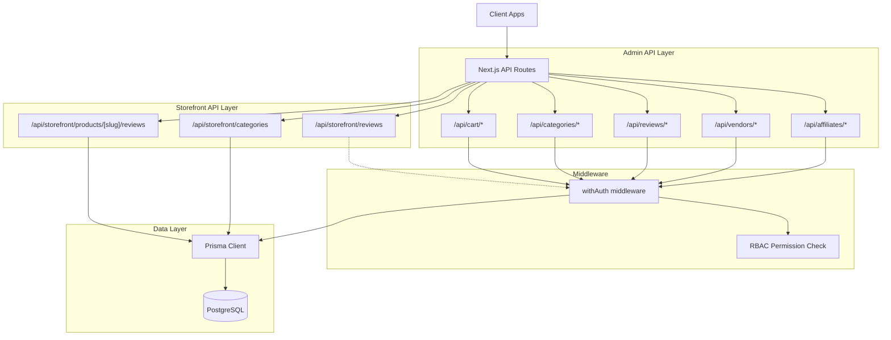
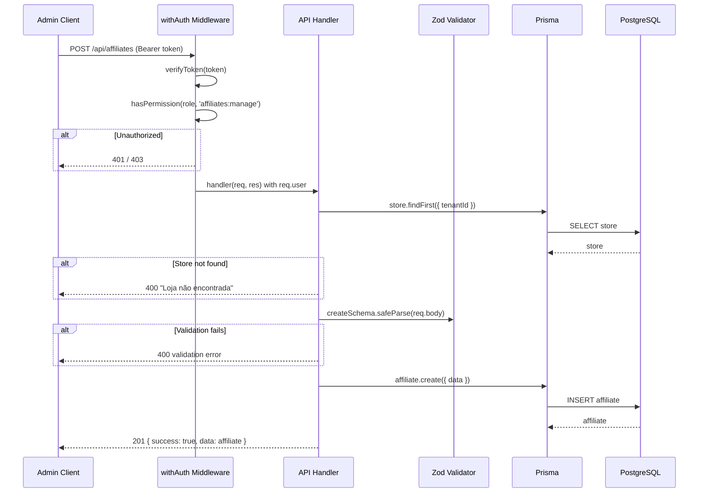
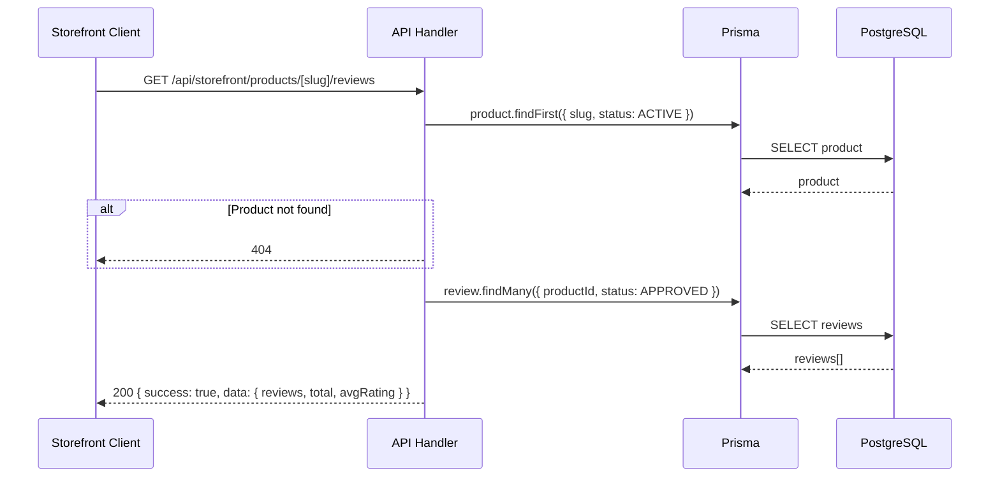
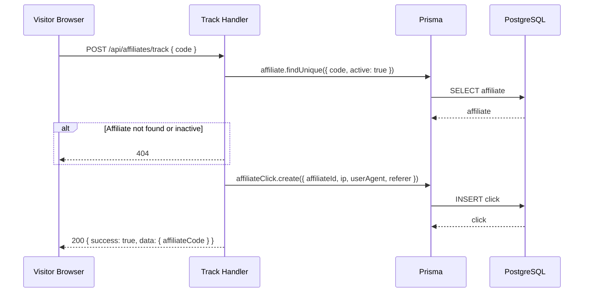

# Design Document: Complete Missing APIs

## Overview

This feature implements the five remaining API resource endpoints for the multi-tenant e-commerce SaaS platform: Affiliates, Vendors, Reviews, Categories, and Cart. All Prisma models already exist in the schema. The existing codebase follows a consistent pattern using Next.js API routes with `withAuth` middleware, Zod validation, Prisma queries scoped by `storeId`/`tenantId`, and standardized response helpers (`ok`, `created`, `badRequest`, `notFound`, etc.).

Each API follows the established conventions: admin endpoints are protected via RBAC permissions, public/storefront endpoints are either unauthenticated or require basic auth, pagination uses `{ page, limit }` query params, and file naming follows `pages/api/{resource}/index.ts` for list/create and `pages/api/{resource}/[id].ts` for detail/update/delete.

The design covers 27 new endpoints across 5 resource domains, all building on the existing infrastructure with zero schema migrations required.

## Architecture



## Sequence Diagrams

### Admin CRUD Flow (e.g., Create Affiliate)



### Public Storefront Flow (e.g., Product Reviews)



### Affiliate Click Tracking Flow



## Components and Interfaces

### Component 1: Affiliates API

**Purpose**: Full CRUD for affiliate management, click tracking, and commission listing.

**Routes**:
| Method | Path | Auth | Permission |
|--------|------|------|------------|
| GET | /api/affiliates | Yes | affiliates:manage |
| POST | /api/affiliates | Yes | affiliates:manage |
| GET | /api/affiliates/[id] | Yes | affiliates:manage |
| PUT | /api/affiliates/[id] | Yes | affiliates:manage |
| POST | /api/affiliates/track | No | — |
| GET | /api/affiliates/[id]/commissions | Yes | affiliates:manage |

**Interface**:
```typescript
// POST /api/affiliates — Create
interface CreateAffiliateBody {
  userId: string          // existing user to make affiliate
  code: string            // unique referral code
  commissionRate?: number // default 5, decimal(5,2)
}

// PUT /api/affiliates/[id] — Update
interface UpdateAffiliateBody {
  commissionRate?: number
  active?: boolean
}

// POST /api/affiliates/track — Track Click (public)
interface TrackClickBody {
  code: string            // affiliate referral code
}

// GET /api/affiliates — List Response
interface AffiliateListResponse {
  data: {
    affiliates: Affiliate[]
    total: number
    page: number
    limit: number
  }
}
```

**Responsibilities**:
- Validate affiliate code uniqueness within the system
- Scope affiliate queries to the tenant via user.tenantId
- Track clicks without authentication (public endpoint)
- List commissions with pagination and status filtering

### Component 2: Vendors API

**Purpose**: Vendor registration, admin management, and payout operations.

**Routes**:
| Method | Path | Auth | Permission |
|--------|------|------|------------|
| GET | /api/vendors | Yes | vendors:manage |
| POST | /api/vendors | Yes | — (any authenticated user) |
| GET | /api/vendors/[id] | Yes | vendors:manage |
| PUT | /api/vendors/[id] | Yes | vendors:manage |
| GET | /api/vendors/[id]/payouts | Yes | vendors:manage |
| POST | /api/vendors/[id]/payouts | Yes | vendors:manage |

**Interface**:
```typescript
// POST /api/vendors — Register as Vendor
interface CreateVendorBody {
  storeName: string
  description?: string
  logoUrl?: string
  bankInfo?: Record<string, unknown>
}

// PUT /api/vendors/[id] — Admin Update
interface UpdateVendorBody {
  status?: 'PENDING' | 'APPROVED' | 'SUSPENDED'
  commissionRate?: number
}

// POST /api/vendors/[id]/payouts — Create Payout
interface CreatePayoutBody {
  amount: number
  notes?: string
}
```

**Responsibilities**:
- Allow any authenticated user to register as vendor (creates Vendor linked to their userId)
- Prevent duplicate vendor registration (userId is @unique)
- Admin-only for status changes, commission rate updates, and payout creation
- Include products and payouts in vendor detail response

### Component 3: Reviews API

**Purpose**: Admin review moderation and storefront review submission/display.

**Routes**:
| Method | Path | Auth | Permission |
|--------|------|------|------------|
| GET | /api/reviews | Yes | products:read |
| PUT | /api/reviews/[id] | Yes | products:write |
| POST | /api/storefront/reviews | Yes | — (authenticated customer) |
| GET | /api/storefront/products/[slug]/reviews | No | — |

**Interface**:
```typescript
// POST /api/storefront/reviews — Submit Review
interface CreateReviewBody {
  productId: string
  rating: number    // 1-5
  title?: string
  body?: string
}

// PUT /api/reviews/[id] — Moderate Review
interface UpdateReviewBody {
  status: 'APPROVED' | 'REJECTED'
}

// GET /api/storefront/products/[slug]/reviews — Response
interface ProductReviewsResponse {
  data: {
    reviews: Review[]
    total: number
    page: number
    limit: number
    avgRating: number
  }
}
```

**Responsibilities**:
- Enforce one review per user per product (@@unique([productId, userId]))
- New reviews default to PENDING status
- Admin can filter reviews by status, product, rating
- Public endpoint only returns APPROVED reviews
- Calculate average rating in storefront response

### Component 4: Categories API

**Purpose**: Admin category CRUD with tree structure and public storefront listing.

**Routes**:
| Method | Path | Auth | Permission |
|--------|------|------|------------|
| GET | /api/categories | Yes | products:read |
| POST | /api/categories | Yes | products:write |
| PUT | /api/categories/[id] | Yes | products:write |
| DELETE | /api/categories/[id] | Yes | products:delete |
| GET | /api/storefront/categories | No | — |

**Interface**:
```typescript
// POST /api/categories — Create
interface CreateCategoryBody {
  name: string
  slug: string
  parentId?: string
  description?: string
  imageUrl?: string
  active?: boolean    // default true
  sortOrder?: number  // default 0
}

// PUT /api/categories/[id] — Update
interface UpdateCategoryBody {
  name?: string
  slug?: string
  parentId?: string | null
  description?: string
  imageUrl?: string
  active?: boolean
  sortOrder?: number
}
```

**Responsibilities**:
- Validate slug uniqueness within store (@@unique([storeId, slug]))
- Support parent-child tree structure via parentId
- Prevent deletion of categories that have associated products
- Storefront endpoint returns only active categories as a tree
- Sort by sortOrder field

### Component 5: Cart API (Server-Side)

**Purpose**: Server-side cart management for authenticated users, enabling abandoned cart recovery.

**Routes**:
| Method | Path | Auth | Permission |
|--------|------|------|------------|
| GET | /api/cart | Yes | — |
| POST | /api/cart | Yes | — |
| PUT | /api/cart/[id] | Yes | — |
| DELETE | /api/cart/[id] | Yes | — |
| DELETE | /api/cart | Yes | — |

**Interface**:
```typescript
// POST /api/cart — Add Item
interface AddCartItemBody {
  productId: string
  variantId?: string
  quantity: number     // positive integer
}

// PUT /api/cart/[id] — Update Quantity
interface UpdateCartItemBody {
  quantity: number     // positive integer
}

// GET /api/cart — Response
interface CartResponse {
  data: {
    items: (CartItem & {
      product: { id: string; name: string; slug: string; price: number; images: ProductImage[] }
      variant?: { id: string; name: string; price: number } | null
    })[]
    total: number      // calculated cart total
    itemCount: number
  }
}
```

**Responsibilities**:
- Scope all cart operations to the authenticated user (userId from JWT)
- Upsert behavior on add: if same productId+variantId exists, increment quantity
- Validate product exists and is ACTIVE before adding
- Validate variant belongs to the product if variantId provided
- Calculate cart total in GET response
- Owner-only: users can only access/modify their own cart items

## Data Models

All models are already defined in the Prisma schema. Key validation rules per resource:

### Affiliate
- `code`: unique globally, required, string
- `commissionRate`: Decimal(5,2), default 5, must be 0-100
- `active`: boolean, default true
- `userId`: unique (one affiliate per user)

### Vendor
- `userId`: unique (one vendor per user)
- `storeName`: required, min 2 chars
- `commissionRate`: Decimal(5,2), default 10, must be 0-100
- `status`: enum VendorStatus (PENDING | APPROVED | SUSPENDED)

### Review
- `rating`: integer, 1-5
- `status`: enum ReviewStatus (PENDING | APPROVED | REJECTED), default PENDING
- `@@unique([productId, userId])`: one review per user per product

### Category
- `@@unique([storeId, slug])`: slug unique within store
- `parentId`: nullable, self-referential for tree structure
- `sortOrder`: integer, default 0

### CartItem
- `@@unique([userId, productId, variantId])`: one entry per product+variant combo per user
- `quantity`: positive integer, min 1

</text>
</invoke>

## Key Functions with Formal Specifications

### Function 1: resolveStore()

```typescript
async function resolveStore(tenantId: string): Promise<Store | null> {
  return prisma.store.findFirst({ where: { tenantId } })
}
```

**Preconditions:**
- `tenantId` is a non-empty string from the authenticated JWT payload

**Postconditions:**
- Returns the Store record associated with the tenant, or null if none exists
- No side effects

### Function 2: paginatedQuery()

```typescript
function buildPagination(query: { page?: string; limit?: string }): { skip: number; take: number; page: number; limit: number } {
  const page = Math.max(1, Number(query.page) || 1)
  const limit = Math.min(100, Math.max(1, Number(query.limit) || 20))
  return { skip: (page - 1) * limit, take: limit, page, limit }
}
```

**Preconditions:**
- `query.page` and `query.limit` are optional string values from query params

**Postconditions:**
- `page` >= 1
- 1 <= `limit` <= 100
- `skip` = (page - 1) * limit
- Default page = 1, default limit = 20

### Function 3: buildCategoryTree()

```typescript
function buildCategoryTree(categories: Category[]): CategoryTreeNode[] {
  // Converts flat list of categories into nested tree structure
}
```

**Preconditions:**
- `categories` is an array of Category objects, each with `id`, `parentId`, `children` fields
- All referenced parentIds exist within the array or are null (root nodes)

**Postconditions:**
- Returns array of root nodes (parentId === null), each with nested `children` arrays
- Every category appears exactly once in the tree
- Sort order is preserved within each level

**Loop Invariants:**
- At each iteration, all previously processed categories are correctly placed in the tree map

## Algorithmic Pseudocode

### Category Tree Construction

```typescript
function buildCategoryTree(flatCategories: Category[]): CategoryTreeNode[] {
  // Step 1: Create a map of id -> node with empty children
  const map = new Map<string, CategoryTreeNode>()
  for (const cat of flatCategories) {
    map.set(cat.id, { ...cat, children: [] })
  }

  // Step 2: Build parent-child relationships
  const roots: CategoryTreeNode[] = []
  for (const cat of flatCategories) {
    const node = map.get(cat.id)!
    if (cat.parentId && map.has(cat.parentId)) {
      map.get(cat.parentId)!.children.push(node)
    } else {
      roots.push(node)
    }
  }

  // Step 3: Sort children at each level by sortOrder
  const sortChildren = (nodes: CategoryTreeNode[]) => {
    nodes.sort((a, b) => a.sortOrder - b.sortOrder)
    nodes.forEach(n => sortChildren(n.children))
  }
  sortChildren(roots)

  return roots
}
```

**Preconditions:**
- flatCategories contains all categories for a given store
- No circular parentId references exist

**Postconditions:**
- Result contains only root-level nodes (parentId is null or references non-existent parent)
- Each node's children array is sorted by sortOrder ascending
- Total nodes in tree equals input array length

### Cart Upsert Logic

```typescript
async function addToCart(userId: string, body: AddCartItemBody): Promise<CartItem> {
  // Step 1: Validate product exists and is ACTIVE
  const product = await prisma.product.findFirst({
    where: { id: body.productId, status: 'ACTIVE' },
    include: { variants: true },
  })
  // ASSERT: product !== null

  // Step 2: If variantId provided, validate it belongs to the product
  if (body.variantId) {
    const variant = product.variants.find(v => v.id === body.variantId)
    // ASSERT: variant !== undefined
  }

  // Step 3: Upsert — if item exists, increment quantity; otherwise create
  const existing = await prisma.cartItem.findUnique({
    where: {
      userId_productId_variantId: {
        userId,
        productId: body.productId,
        variantId: body.variantId ?? '',
      },
    },
  })

  if (existing) {
    return prisma.cartItem.update({
      where: { id: existing.id },
      data: { quantity: existing.quantity + body.quantity },
    })
  }

  return prisma.cartItem.create({
    data: {
      userId,
      productId: body.productId,
      variantId: body.variantId ?? null,
      quantity: body.quantity,
    },
  })
}
```

**Preconditions:**
- userId is a valid authenticated user ID
- body.productId references an existing ACTIVE product
- body.quantity > 0
- If body.variantId is provided, it belongs to the referenced product

**Postconditions:**
- Exactly one CartItem exists for the (userId, productId, variantId) combination
- If item existed before, quantity is incremented by body.quantity
- If item is new, quantity equals body.quantity

### Affiliate Click Tracking

```typescript
async function trackAffiliateClick(
  code: string,
  ip: string | null,
  userAgent: string | null,
  referer: string | null
): Promise<AffiliateClick> {
  // Step 1: Find active affiliate by code
  const affiliate = await prisma.affiliate.findUnique({
    where: { code },
  })
  // ASSERT: affiliate !== null && affiliate.active === true

  // Step 2: Record click
  return prisma.affiliateClick.create({
    data: {
      affiliateId: affiliate.id,
      ip,
      userAgent,
      referer,
    },
  })
}
```

**Preconditions:**
- code is a non-empty string
- An active affiliate with this code exists

**Postconditions:**
- A new AffiliateClick record is created linked to the affiliate
- Click metadata (ip, userAgent, referer) is stored as provided (nullable)

### Category Deletion Guard

```typescript
async function deleteCategory(categoryId: string, storeId: string): Promise<void> {
  // Step 1: Verify category exists and belongs to store
  const category = await prisma.category.findFirst({
    where: { id: categoryId, storeId },
    include: { _count: { select: { products: true, children: true } } },
  })
  // ASSERT: category !== null

  // Step 2: Check no products reference this category
  // ASSERT: category._count.products === 0

  // Step 3: Check no child categories exist
  // ASSERT: category._count.children === 0

  // Step 4: Delete
  await prisma.category.delete({ where: { id: categoryId } })
}
```

**Preconditions:**
- categoryId and storeId are valid non-empty strings
- Category exists and belongs to the store

**Postconditions:**
- Category is deleted if and only if it has zero associated products AND zero child categories
- If products or children exist, operation fails with 400 error
- No cascading deletes of products or child categories

## Example Usage

```typescript
// Example 1: Admin creates an affiliate
const res = await fetch('/api/affiliates', {
  method: 'POST',
  headers: { Authorization: `Bearer ${adminToken}`, 'Content-Type': 'application/json' },
  body: JSON.stringify({ userId: 'user_abc', code: 'PARTNER10', commissionRate: 10 }),
})
// → 201 { success: true, data: { id: '...', code: 'PARTNER10', commissionRate: 10, active: true } }

// Example 2: Public affiliate click tracking
const res = await fetch('/api/affiliates/track', {
  method: 'POST',
  headers: { 'Content-Type': 'application/json' },
  body: JSON.stringify({ code: 'PARTNER10' }),
})
// → 200 { success: true, data: { affiliateCode: 'PARTNER10' } }

// Example 3: User registers as vendor
const res = await fetch('/api/vendors', {
  method: 'POST',
  headers: { Authorization: `Bearer ${userToken}`, 'Content-Type': 'application/json' },
  body: JSON.stringify({ storeName: 'My Vendor Shop', description: 'Handmade goods' }),
})
// → 201 { success: true, data: { id: '...', storeName: 'My Vendor Shop', status: 'PENDING' } }

// Example 4: Customer submits a review
const res = await fetch('/api/storefront/reviews', {
  method: 'POST',
  headers: { Authorization: `Bearer ${customerToken}`, 'Content-Type': 'application/json' },
  body: JSON.stringify({ productId: 'prod_123', rating: 5, title: 'Great!', body: 'Loved it' }),
})
// → 201 { success: true, data: { id: '...', status: 'PENDING', rating: 5 } }

// Example 5: Add item to server-side cart
const res = await fetch('/api/cart', {
  method: 'POST',
  headers: { Authorization: `Bearer ${customerToken}`, 'Content-Type': 'application/json' },
  body: JSON.stringify({ productId: 'prod_123', quantity: 2 }),
})
// → 201 { success: true, data: { id: '...', quantity: 2 } }

// Example 6: Get storefront categories as tree
const res = await fetch('/api/storefront/categories')
// → 200 { success: true, data: [{ id: '...', name: 'Clothing', children: [{ name: 'Shirts', children: [] }] }] }

// Example 7: Delete category (guarded)
const res = await fetch('/api/categories/cat_123', {
  method: 'DELETE',
  headers: { Authorization: `Bearer ${adminToken}` },
})
// → 204 (if no products/children) or 400 "Categoria possui produtos associados"
```

## Correctness Properties

The following properties must hold for all valid inputs:

1. **Tenant Isolation**: For all admin endpoints, `∀ request r, response data d: d.storeId ∈ stores(r.user.tenantId)`. No endpoint ever returns or modifies data belonging to a different tenant.

2. **Permission Enforcement**: `∀ request r to admin endpoint: hasPermission(r.user.role, requiredPermission) = true`, otherwise 403 is returned.

3. **Affiliate Code Uniqueness**: `∀ affiliate a1, a2: a1.code = a2.code ⟹ a1.id = a2.id`. The affiliate code is globally unique.

4. **One Vendor Per User**: `∀ vendor v1, v2: v1.userId = v2.userId ⟹ v1.id = v2.id`. A user can only have one vendor profile.

5. **One Review Per User Per Product**: `∀ review r1, r2: (r1.productId = r2.productId ∧ r1.userId = r2.userId) ⟹ r1.id = r2.id`.

6. **Category Slug Uniqueness Per Store**: `∀ category c1, c2 in store s: c1.slug = c2.slug ⟹ c1.id = c2.id`.

7. **Category Deletion Safety**: `∀ category c: delete(c) succeeds ⟹ count(products where categoryId = c.id) = 0 ∧ count(categories where parentId = c.id) = 0`.

8. **Cart Item Uniqueness**: `∀ cartItem ci1, ci2: (ci1.userId = ci2.userId ∧ ci1.productId = ci2.productId ∧ ci1.variantId = ci2.variantId) ⟹ ci1.id = ci2.id`.

9. **Cart Ownership**: `∀ cart operation by user u on cartItem ci: ci.userId = u.sub`. Users can only access their own cart items.

10. **Review Visibility**: `∀ review r returned by storefront endpoint: r.status = 'APPROVED'`. Public endpoints never expose pending or rejected reviews.

11. **Cart Product Validity**: `∀ cartItem ci created: ∃ product p where p.id = ci.productId ∧ p.status = 'ACTIVE'`. Cart items can only reference active products.

12. **Pagination Bounds**: `∀ paginated response: page >= 1 ∧ 1 <= limit <= 100 ∧ data.length <= limit`.

## Error Handling

### Error Scenario 1: Store Not Found

**Condition**: Authenticated user's tenantId does not map to any store
**Response**: `400 { success: false, error: "Loja não encontrada" }`
**Recovery**: User must be associated with a valid tenant that has a store

### Error Scenario 2: Duplicate Affiliate Code

**Condition**: POST /api/affiliates with a code that already exists
**Response**: `400 { success: false, error: "Código de afiliado já existe" }`
**Recovery**: Client should retry with a different code

### Error Scenario 3: Duplicate Vendor Registration

**Condition**: POST /api/vendors when user already has a vendor profile
**Response**: `400 { success: false, error: "Usuário já é um vendedor" }`
**Recovery**: User should use PUT to update their existing vendor profile

### Error Scenario 4: Duplicate Review

**Condition**: POST /api/storefront/reviews for a product the user already reviewed
**Response**: `400 { success: false, error: "Você já avaliou este produto" }`
**Recovery**: User cannot submit another review for the same product

### Error Scenario 5: Category Deletion with Products

**Condition**: DELETE /api/categories/[id] when category has associated products
**Response**: `400 { success: false, error: "Categoria possui produtos associados" }`
**Recovery**: Admin must reassign or remove products from the category first

### Error Scenario 6: Category Deletion with Children

**Condition**: DELETE /api/categories/[id] when category has child categories
**Response**: `400 { success: false, error: "Categoria possui subcategorias" }`
**Recovery**: Admin must delete or reassign child categories first

### Error Scenario 7: Cart Item for Inactive Product

**Condition**: POST /api/cart with a productId that is not ACTIVE
**Response**: `400 { success: false, error: "Produto não encontrado ou inativo" }`
**Recovery**: Client should remove the item from the UI

### Error Scenario 8: Invalid Variant for Product

**Condition**: POST /api/cart with a variantId that doesn't belong to the specified product
**Response**: `400 { success: false, error: "Variante não pertence ao produto" }`
**Recovery**: Client should re-fetch product variants

### Error Scenario 9: Inactive Affiliate Click

**Condition**: POST /api/affiliates/track with a code for an inactive affiliate
**Response**: `404 { success: false, error: "Não encontrado" }`
**Recovery**: Affiliate link is no longer valid

### Error Scenario 10: Cart Item Ownership Violation

**Condition**: PUT/DELETE /api/cart/[id] where the cart item belongs to a different user
**Response**: `404 { success: false, error: "Não encontrado" }`
**Recovery**: None — the item is invisible to the requesting user

## Testing Strategy

### Unit Testing Approach

Each API handler should be tested using `node-mocks-http` (already in devDependencies) to create mock request/response objects. Key test cases per resource:

- **Affiliates**: Create with valid/invalid data, duplicate code rejection, list with pagination, update commission rate, track click for active/inactive affiliate
- **Vendors**: Register as vendor, duplicate registration rejection, admin status update, payout creation with valid/invalid amounts
- **Reviews**: Submit review, duplicate review rejection, admin moderation (approve/reject), storefront listing only shows approved
- **Categories**: Create with/without parent, slug uniqueness, delete guarded by products/children, tree structure construction
- **Cart**: Add item, upsert quantity increment, update quantity, delete item, clear cart, ownership enforcement

### Property-Based Testing Approach

**Property Test Library**: fast-check

Key properties to test:
- Pagination always returns `data.length <= limit` and `page >= 1`
- Category tree construction: total nodes in tree equals input count
- Cart total calculation: sum of (item.price * item.quantity) for all items
- Tenant isolation: randomly generated tenantIds never cross-contaminate

### Integration Testing Approach

End-to-end tests using actual Prisma client against a test database:
- Full affiliate lifecycle: create → track click → create order → commission generated
- Full vendor lifecycle: register → admin approve → create products → payout
- Full review lifecycle: customer submits → admin approves → visible on storefront
- Cart to checkout flow: add items → update quantities → checkout → cart cleared

## Security Considerations

- **Tenant Isolation**: Every query is scoped by storeId derived from the authenticated user's tenantId. No endpoint accepts storeId as a client parameter.
- **RBAC Enforcement**: Admin endpoints use `withAuth(handler, 'permission')` pattern. The permission check happens in middleware before the handler executes.
- **Cart Ownership**: Cart queries always include `userId` from the JWT. Users cannot access or modify other users' carts.
- **Public Endpoint Rate Limiting**: The `/api/affiliates/track` endpoint is public and should be rate-limited to prevent abuse (implementation note for infrastructure layer).
- **Input Validation**: All request bodies are validated with Zod schemas before any database operations. Invalid input is rejected with 400 before reaching Prisma.
- **SQL Injection Prevention**: Prisma's parameterized queries prevent SQL injection by design.

## Dependencies

- **@reino-flor/database** (workspace): Prisma client and all model types
- **@reino-flor/auth** (workspace): JWT verification, RBAC permission checks
- **zod** (^3.23.0): Request body validation
- **next** (^14.2.0): API route framework
- No new external dependencies required — all APIs build on existing infrastructure
