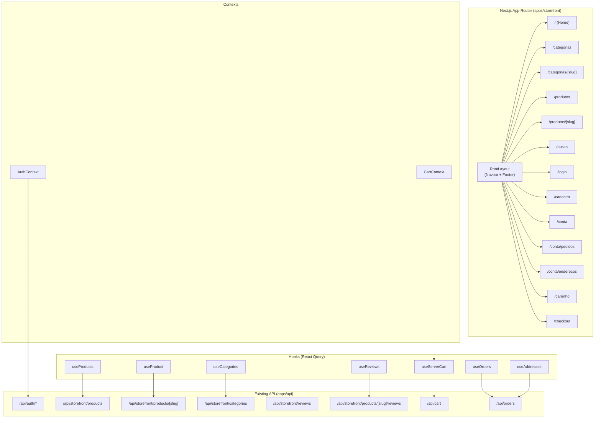
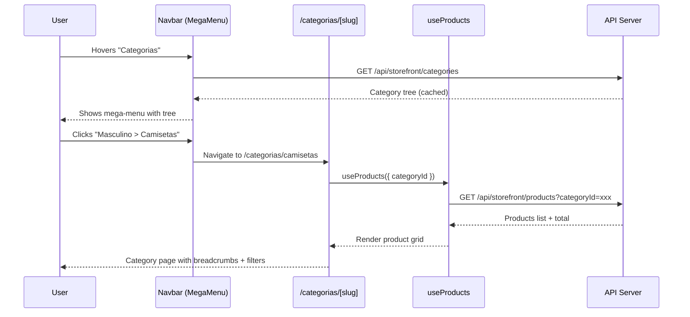
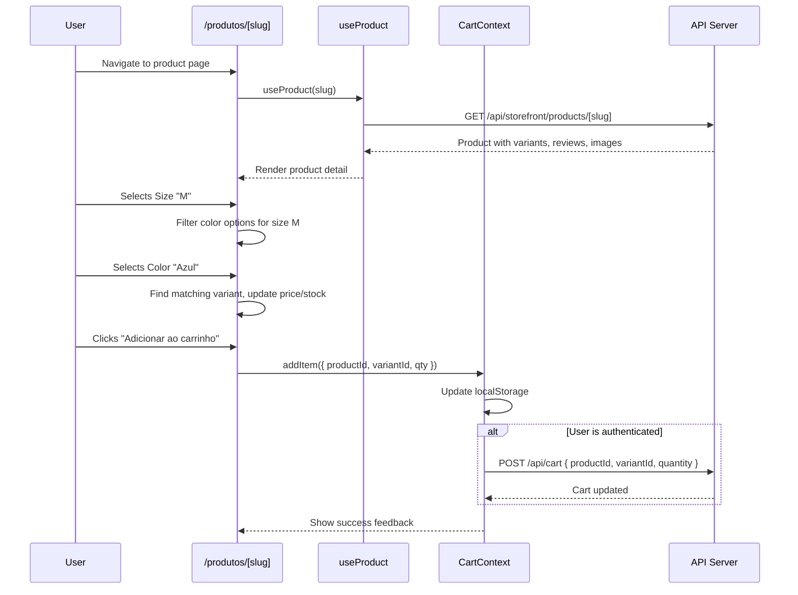
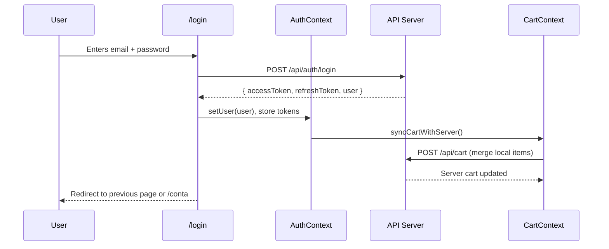
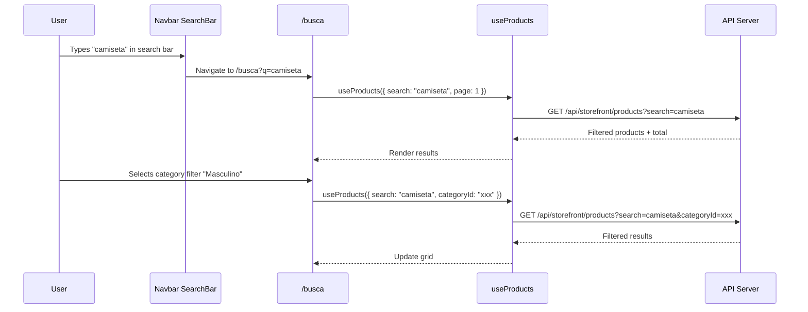

# Design Document: Complete Storefront

## Overview

This feature completes the multi-tenant e-commerce storefront by building all missing pages and improving existing ones. The storefront is generic — it must work for any product type (clothing, electronics, food, etc.) without domain-specific assumptions. The platform is multi-tenant, meaning each store can sell any category of products with its own category tree.

The work covers six areas: (1) category browsing pages with tree navigation, (2) enhanced product detail page with dynamic variant selectors, reviews, and related products, (3) a dedicated search results page with filters, (4) user account pages (profile, order history, addresses), (5) authentication pages (login/register), and (6) navigation improvements including a category mega-menu, mobile-responsive nav, and a proper footer.

All backend APIs already exist and are functional. This is purely a frontend effort within the Next.js 14 App Router storefront app (`apps/storefront`), using React Query for data fetching, TailwindCSS for styling, Zod for validation, and Lucide for icons.

## Architecture



## Sequence Diagrams

### Category Browsing Flow



### Product Detail with Variant Selection



### Authentication Flow



### Search with Filters



## Components and Interfaces

### Component 1: CategoryMegaMenu

**Purpose**: Renders a dropdown mega-menu in the Navbar showing the category tree with parent categories and their children. Fetches categories on mount and caches them.

```typescript
interface CategoryNode {
  id: string
  name: string
  slug: string
  description: string | null
  imageUrl: string | null
  sortOrder: number
  _count: { products: number }
  children: CategoryNode[]
}

interface CategoryMegaMenuProps {
  categories: CategoryNode[]
  isOpen: boolean
  onClose: () => void
}
```

**Responsibilities**:
- Render top-level categories as columns
- Show child categories nested under each parent
- Link each category to `/categorias/[slug]`
- Close on click outside or navigation
- Responsive: full-width dropdown on desktop, accordion on mobile

### Component 2: VariantSelector

**Purpose**: Renders dynamic variant option selectors (size, color, etc.) based on the product's variant options. Groups variants by option type and handles cross-filtering (selecting size filters available colors).

```typescript
interface Variant {
  id: string
  name: string
  price: number
  stock: number
  options: Record<string, string>  // e.g. { size: "M", color: "Azul" }
  imageUrl?: string
}

interface VariantSelectorProps {
  variants: Variant[]
  selectedVariantId: string | undefined
  onSelect: (variantId: string) => void
}
```

**Responsibilities**:
- Extract unique option types from all variants (e.g., "size", "color")
- Render a selector group for each option type
- Cross-filter: when user selects size "M", only show colors available in size M
- Update selected variant when all options are chosen
- Show variant-specific price and stock
- Disable out-of-stock combinations

### Component 3: ReviewSection

**Purpose**: Displays product reviews with rating summary and allows authenticated users to submit new reviews.

```typescript
interface ReviewSectionProps {
  productSlug: string
  productId: string
  initialReviews: Review[]
  avgRating: number
  totalReviews: number
}

interface Review {
  id: string
  rating: number
  title?: string
  body?: string
  createdAt: string
  user: { name: string }
}

interface ReviewFormData {
  rating: number
  title?: string
  body?: string
}
```

**Responsibilities**:
- Show average rating with star visualization
- List reviews with pagination (load more)
- Show review submission form for authenticated users
- Validate review form with Zod
- Optimistic update on submission
- Show "login to review" prompt for unauthenticated users

### Component 4: SearchFilters

**Purpose**: Sidebar/top-bar filter panel for the search results page. Allows filtering by category, price range, and sort order.

```typescript
interface SearchFiltersProps {
  categories: CategoryNode[]
  selectedCategoryId?: string
  sortBy: SortOption
  onCategoryChange: (categoryId: string | undefined) => void
  onSortChange: (sort: SortOption) => void
}

type SortOption = 'newest' | 'price_asc' | 'price_desc' | 'name_asc'
```

**Responsibilities**:
- Render category filter as a collapsible tree
- Render sort dropdown
- Sync filter state with URL query params
- Mobile: render as a slide-out drawer
- Clear all filters action

### Component 5: AccountLayout

**Purpose**: Shared layout for all `/conta/*` pages with sidebar navigation.

```typescript
interface AccountLayoutProps {
  children: React.ReactNode
}
```

**Responsibilities**:
- Sidebar with links: Perfil, Pedidos, Endereços
- Redirect to `/login` if not authenticated
- Show user name and email in sidebar header
- Responsive: sidebar collapses to top tabs on mobile

## Data Models

### Category Tree (from API)

```typescript
interface CategoryNode {
  id: string
  name: string
  slug: string
  description: string | null
  imageUrl: string | null
  sortOrder: number
  _count: { products: number }
  children: CategoryNode[]
}
```

**Validation Rules**:
- `slug` is unique per store
- `children` can be empty (leaf category)
- Tree depth is max 2 levels (parent > child)

### Product (Extended)

```typescript
interface Product {
  id: string
  name: string
  slug: string
  description?: string
  price: number
  comparePrice?: number
  status: string
  featured: boolean
  sku?: string
  seoTitle?: string
  seoDescription?: string
  category?: { id: string; name: string; slug: string }
  inventory?: { quantity: number }
  images: { url: string; alt?: string }[]
  variants: Variant[]
  reviews: Review[]
  _count?: { reviews: number }
}
```

### Server Cart Item

```typescript
interface ServerCartItem {
  id: string
  productId: string
  variantId?: string
  quantity: number
  product: {
    id: string
    name: string
    slug: string
    price: number
    images: { url: string }[]
  }
  variant?: {
    id: string
    name: string
    price: number
  }
}

interface ServerCart {
  items: ServerCartItem[]
  total: number
  itemCount: number
}
```

### User Address

```typescript
interface Address {
  id: string
  label: string
  street: string
  number: string
  complement?: string
  district: string
  city: string
  state: string
  zipCode: string
  country: string
  isDefault: boolean
}
```

### Order (List View)

```typescript
interface OrderSummary {
  id: string
  status: OrderStatus
  total: number
  itemCount: number
  createdAt: string
  items: {
    name: string
    quantity: number
    price: number
    imageUrl?: string
  }[]
}

type OrderStatus = 'PENDING' | 'CONFIRMED' | 'PROCESSING' | 'SHIPPED' | 'DELIVERED' | 'CANCELLED' | 'REFUNDED'
```


## Key Functions with Formal Specifications

### Function 1: extractVariantOptions()

```typescript
function extractVariantOptions(
  variants: Variant[]
): Map<string, string[]>
```

**Preconditions:**
- `variants` is a non-empty array
- Each variant has an `options` object with string key-value pairs

**Postconditions:**
- Returns a Map where keys are option type names (e.g., "size", "color")
- Values are arrays of unique option values for that type
- Order of values preserves first-seen order from variants array
- All option types present in any variant are included

**Loop Invariants:**
- At each iteration, the Map contains all option types seen so far with their unique values

### Function 2: findMatchingVariant()

```typescript
function findMatchingVariant(
  variants: Variant[],
  selectedOptions: Record<string, string>
): Variant | undefined
```

**Preconditions:**
- `variants` is a non-empty array
- `selectedOptions` has at least one key-value pair
- Keys in `selectedOptions` correspond to option types in variants

**Postconditions:**
- Returns the variant whose `options` match all entries in `selectedOptions`, or `undefined`
- If multiple variants match (shouldn't happen with proper data), returns the first match
- Does not mutate input arrays

### Function 3: getAvailableOptionsForSelection()

```typescript
function getAvailableOptionsForSelection(
  variants: Variant[],
  selectedOptions: Record<string, string>,
  targetOptionType: string
): string[]
```

**Preconditions:**
- `variants` is non-empty
- `targetOptionType` is a valid option type present in at least one variant
- `selectedOptions` does not contain `targetOptionType` as a key

**Postconditions:**
- Returns array of values for `targetOptionType` that are available given current selections
- A value is "available" if there exists at least one variant matching all `selectedOptions` AND having that value for `targetOptionType`
- Only includes values from in-stock variants (stock > 0)
- Result is deduplicated

### Function 4: buildBreadcrumbs()

```typescript
interface Breadcrumb {
  label: string
  href: string
}

function buildBreadcrumbs(
  categorySlug: string,
  categories: CategoryNode[]
): Breadcrumb[]
```

**Preconditions:**
- `categorySlug` is a non-empty string
- `categories` is the full category tree from the API

**Postconditions:**
- Returns array starting with `{ label: "Home", href: "/" }`
- Followed by `{ label: "Categorias", href: "/categorias" }`
- If category has a parent, includes parent breadcrumb
- Ends with current category (no href, or href to self)
- Returns at least 2 items (Home + Categorias) even if category not found

### Function 5: mergeCartWithServer()

```typescript
async function mergeCartWithServer(
  localItems: CartItem[],
  api: AxiosInstance
): Promise<ServerCart>
```

**Preconditions:**
- `localItems` is an array (may be empty)
- `api` is an authenticated axios instance (has valid Bearer token)
- User is authenticated

**Postconditions:**
- All local items are sent to server via POST /api/cart
- If a local item already exists on server, quantities are merged (server handles upsert)
- Returns the final server cart state
- Local cart is cleared after successful merge
- If any individual item fails (e.g., product inactive), it is skipped silently

### Function 6: syncCartState()

```typescript
function syncCartState(
  isAuthenticated: boolean,
  localItems: CartItem[],
  serverCart: ServerCart | null
): CartItem[]
```

**Preconditions:**
- `isAuthenticated` is a boolean
- `localItems` is the current localStorage cart
- `serverCart` is the fetched server cart (null if not authenticated or fetch failed)

**Postconditions:**
- If not authenticated: returns `localItems` unchanged
- If authenticated and `serverCart` is available: returns items derived from `serverCart.items`
- Mapped server items include all fields needed for CartItem interface
- Price comes from variant price if variant exists, otherwise product price

## Algorithmic Pseudocode

### Variant Cross-Filter Algorithm

```typescript
// Given a product with variants, determine which option values
// are selectable based on current user selections.
//
// Example: Product has variants:
//   { size: "M", color: "Azul", stock: 5 }
//   { size: "M", color: "Vermelho", stock: 0 }
//   { size: "G", color: "Azul", stock: 3 }
//
// If user selects size="M":
//   Available colors = ["Azul"] (Vermelho is out of stock)

function computeVariantState(
  variants: Variant[],
  currentSelections: Record<string, string>
): {
  optionGroups: Map<string, { value: string; available: boolean; inStock: boolean }[]>
  matchedVariant: Variant | undefined
  allOptionsSelected: boolean
} {
  // Step 1: Extract all option types and their unique values
  const optionTypes = extractVariantOptions(variants)

  // Step 2: For each option type, determine availability
  const optionGroups = new Map<string, { value: string; available: boolean; inStock: boolean }[]>()

  for (const [optionType, values] of optionTypes) {
    const enrichedValues = values.map(value => {
      // Check if selecting this value is compatible with other selections
      const otherSelections = { ...currentSelections }
      delete otherSelections[optionType]

      const compatibleVariants = variants.filter(v => {
        // Must match this value
        if (v.options[optionType] !== value) return false
        // Must match all other current selections
        for (const [key, sel] of Object.entries(otherSelections)) {
          if (v.options[key] !== sel) return false
        }
        return true
      })

      return {
        value,
        available: compatibleVariants.length > 0,
        inStock: compatibleVariants.some(v => v.stock > 0),
      }
    })

    optionGroups.set(optionType, enrichedValues)
  }

  // Step 3: Find matched variant if all options selected
  const allOptionsSelected = optionTypes.size > 0 &&
    [...optionTypes.keys()].every(type => currentSelections[type] !== undefined)

  const matchedVariant = allOptionsSelected
    ? findMatchingVariant(variants, currentSelections)
    : undefined

  return { optionGroups, matchedVariant, allOptionsSelected }
}
```

### Category Tree Search Algorithm

```typescript
// Find a category node by slug in a tree structure.
// Returns the node and its ancestor path for breadcrumb generation.

function findCategoryInTree(
  tree: CategoryNode[],
  targetSlug: string,
  ancestors: CategoryNode[] = []
): { node: CategoryNode; path: CategoryNode[] } | null {
  for (const node of tree) {
    if (node.slug === targetSlug) {
      return { node, path: [...ancestors, node] }
    }
    if (node.children.length > 0) {
      const found = findCategoryInTree(node.children, targetSlug, [...ancestors, node])
      if (found) return found
    }
  }
  return null
}
```

### Cart Sync Algorithm

```typescript
// Synchronize local cart with server cart on authentication state change.
// This runs when: (a) user logs in, (b) app loads with existing auth tokens.

async function handleCartSync(
  isAuthenticated: boolean,
  localItems: CartItem[],
  dispatch: (action: CartAction) => void,
  api: AxiosInstance
): Promise<void> {
  if (!isAuthenticated) return

  // Step 1: Fetch current server cart
  const { data } = await api.get('/api/cart')
  const serverCart: ServerCart = data.data

  // Step 2: If local cart has items not on server, merge them
  if (localItems.length > 0) {
    const serverProductIds = new Set(
      serverCart.items.map(i => i.productId + (i.variantId ?? ''))
    )

    const newItems = localItems.filter(
      item => !serverProductIds.has(item.productId + (item.variantId ?? ''))
    )

    // Add new local items to server
    for (const item of newItems) {
      try {
        await api.post('/api/cart', {
          productId: item.productId,
          variantId: item.variantId,
          quantity: item.quantity,
        })
      } catch {
        // Skip items that fail (product may be inactive)
      }
    }

    // Re-fetch merged cart
    if (newItems.length > 0) {
      const { data: merged } = await api.get('/api/cart')
      dispatch({ type: 'LOAD_FROM_SERVER', cart: merged.data })
      return
    }
  }

  // Step 3: Load server cart as source of truth
  dispatch({ type: 'LOAD_FROM_SERVER', cart: serverCart })
}
```

### URL-Synced Search Filter Algorithm

```typescript
// Keeps search page filters in sync with URL query parameters.
// Enables shareable/bookmarkable search URLs.

interface SearchParams {
  q: string
  categoryId?: string
  sort: SortOption
  page: number
}

function parseSearchParams(searchParams: URLSearchParams): SearchParams {
  return {
    q: searchParams.get('q') ?? '',
    categoryId: searchParams.get('categoria') ?? undefined,
    sort: (searchParams.get('ordem') as SortOption) ?? 'newest',
    page: Math.max(1, Number(searchParams.get('pagina')) ?? 1),
  }
}

function buildSearchUrl(params: SearchParams): string {
  const url = new URLSearchParams()
  if (params.q) url.set('q', params.q)
  if (params.categoryId) url.set('categoria', params.categoryId)
  if (params.sort !== 'newest') url.set('ordem', params.sort)
  if (params.page > 1) url.set('pagina', String(params.page))
  return `/busca?${url.toString()}`
}
```

## Example Usage

### Using VariantSelector on Product Page

```typescript
// In /produtos/[slug]/page.tsx
const [selectedOptions, setSelectedOptions] = useState<Record<string, string>>({})

const { optionGroups, matchedVariant, allOptionsSelected } =
  computeVariantState(product.variants, selectedOptions)

const handleOptionSelect = (optionType: string, value: string) => {
  setSelectedOptions(prev => ({ ...prev, [optionType]: value }))
}

const handleAddToCart = () => {
  if (!allOptionsSelected && product.variants.length > 0) return
  addItem({
    productId: product.id,
    variantId: matchedVariant?.id,
    name: product.name,
    price: matchedVariant ? matchedVariant.price : Number(product.price),
    quantity: qty,
    slug: product.slug,
    imageUrl: matchedVariant?.imageUrl ?? product.images[0]?.url,
  })
}
```

### Using Categories Hook for Mega-Menu

```typescript
// In Navbar component
const { data: categories } = useCategories()

// Render mega-menu
<CategoryMegaMenu
  categories={categories ?? []}
  isOpen={megaMenuOpen}
  onClose={() => setMegaMenuOpen(false)}
/>
```

### Search Page with URL-Synced Filters

```typescript
// In /busca/page.tsx
'use client'
import { useSearchParams, useRouter } from 'next/navigation'

export default function SearchPage() {
  const searchParams = useSearchParams()
  const router = useRouter()
  const params = parseSearchParams(searchParams)

  const { data, isLoading } = useProducts({
    search: params.q,
    categoryId: params.categoryId,
    page: params.page,
    limit: 12,
  })

  const updateFilter = (updates: Partial<SearchParams>) => {
    const newParams = { ...params, ...updates, page: 1 }
    router.push(buildSearchUrl(newParams))
  }

  return (
    <div>
      <SearchFilters
        categories={categories}
        selectedCategoryId={params.categoryId}
        sortBy={params.sort}
        onCategoryChange={(id) => updateFilter({ categoryId: id })}
        onSortChange={(sort) => updateFilter({ sort })}
      />
      <ProductGrid products={data?.products ?? []} />
    </div>
  )
}
```

## Correctness Properties

1. **Variant Selection Completeness**: ∀ product P with variants, if user selects one value for each option type, then exactly one variant matches OR zero variants match (never more than one).

2. **Cart Sync Idempotency**: ∀ cart sync operation, calling `mergeCartWithServer` twice with the same local items produces the same server cart state (no duplicate items).

3. **Breadcrumb Consistency**: ∀ category C in the tree, `buildBreadcrumbs(C.slug, tree)` returns a path where each breadcrumb's href is a valid route, and the last item matches C.

4. **Search URL Roundtrip**: ∀ SearchParams P, `parseSearchParams(new URLSearchParams(buildSearchUrl(P).split('?')[1]))` equals P (URL encoding is lossless).

5. **Category Tree Integrity**: ∀ CategoryNode N in the tree, N.children contains only nodes whose parentId equals N.id, and no node appears in multiple parents.

6. **Auth Guard Consistency**: ∀ protected route R under `/conta/*`, if user is not authenticated, R redirects to `/login?redirect=R` and after successful login, user is redirected back to R.

7. **Variant Availability Correctness**: ∀ option value V shown as "available" in VariantSelector, there exists at least one in-stock variant matching V and all other current selections.

## Error Handling

### Error Scenario 1: Category Not Found

**Condition**: User navigates to `/categorias/[slug]` with a slug that doesn't exist in the category tree
**Response**: Show a "Categoria não encontrada" message with a link back to `/categorias`
**Recovery**: User can navigate to the categories listing or use the mega-menu

### Error Scenario 2: Product Variant Out of Stock

**Condition**: User selects a variant combination that has stock = 0
**Response**: Disable the "Adicionar ao carrinho" button, show "Esgotado" badge on the variant
**Recovery**: User can select a different variant combination; out-of-stock options are visually dimmed but still visible

### Error Scenario 3: Cart Sync Failure

**Condition**: Server cart API returns error during sync (network issue, expired token)
**Response**: Keep local cart intact, show a non-blocking toast notification
**Recovery**: Retry sync on next page navigation or manual refresh; local cart serves as fallback

### Error Scenario 4: Authentication Token Expired

**Condition**: API returns 401 during any authenticated request
**Response**: Axios interceptor attempts token refresh via `/api/auth/refresh`
**Recovery**: If refresh succeeds, retry original request. If refresh fails, clear auth state and redirect to login with return URL.

### Error Scenario 5: Search Returns No Results

**Condition**: Search query or filter combination yields zero products
**Response**: Show empty state with illustration, suggest clearing filters or trying different terms
**Recovery**: Show "Limpar filtros" button that resets all filters; keep search term visible for editing

### Error Scenario 6: Review Submission Failure

**Condition**: User submits review but API returns error (already reviewed, product inactive)
**Response**: Show inline error message below the form with the API error message
**Recovery**: Form retains user input; user can modify and retry

## Testing Strategy

### Unit Testing Approach

- Test `extractVariantOptions` with various variant configurations
- Test `findMatchingVariant` with exact matches, partial matches, and no matches
- Test `computeVariantState` cross-filtering logic
- Test `buildBreadcrumbs` with root categories, nested categories, and missing categories
- Test `parseSearchParams` / `buildSearchUrl` roundtrip
- Test `syncCartState` with authenticated/unauthenticated scenarios
- Use Jest + React Testing Library for component tests

### Property-Based Testing Approach

**Property Test Library**: fast-check

- Variant selection: For any set of variants and any complete selection, at most one variant matches
- URL roundtrip: For any valid SearchParams, parse(build(params)) === params
- Breadcrumb ordering: For any category in tree, breadcrumbs are ordered from root to leaf
- Cart merge: For any local + server cart combination, merged cart has no duplicate product+variant pairs

### Integration Testing Approach

- Test full category navigation flow: mega-menu → category page → product page
- Test search flow: type query → see results → apply filter → see filtered results
- Test auth flow: register → login → access account pages → logout
- Test cart sync: add items locally → login → verify items appear in server cart

## Performance Considerations

- **Category tree caching**: Fetch categories once on app load, cache with React Query (staleTime: 5 minutes). The tree is small and rarely changes.
- **Product images**: Use Next.js `<Image>` component with lazy loading for product grids. Use `priority` for above-the-fold hero images.
- **Search debouncing**: Debounce search input by 300ms to avoid excessive API calls while typing.
- **Pagination over infinite scroll**: Use traditional pagination for SEO-friendliness and predictable performance.
- **Server-side rendering**: Category pages and product detail pages should use SSR (or ISR with revalidation) for SEO. Search page can be client-side rendered.
- **Code splitting**: Each route is automatically code-split by Next.js App Router. Mega-menu component should be lazy-loaded.

## Security Considerations

- **Auth tokens**: Access tokens stored in localStorage (existing pattern). Refresh token rotation is already implemented in the API interceptor.
- **Protected routes**: Account pages (`/conta/*`) must check authentication on the client side and redirect to login if not authenticated.
- **Review submission**: Only authenticated users can submit reviews. The API already enforces one review per user per product.
- **XSS prevention**: All user-generated content (review text, product descriptions) is rendered as text content, not dangerouslySetInnerHTML.
- **CSRF**: API uses Bearer token authentication (not cookies), so CSRF is not a concern.
- **Input validation**: All forms use Zod schemas for client-side validation before submission.

## Dependencies

- **Existing**: Next.js 14, React 18, TailwindCSS, @tanstack/react-query, axios, lucide-react, zod, react-hook-form, @hookform/resolvers
- **No new dependencies required**: All needed functionality can be built with the existing stack
- **API endpoints**: All required endpoints already exist and are functional (see Architecture section)
