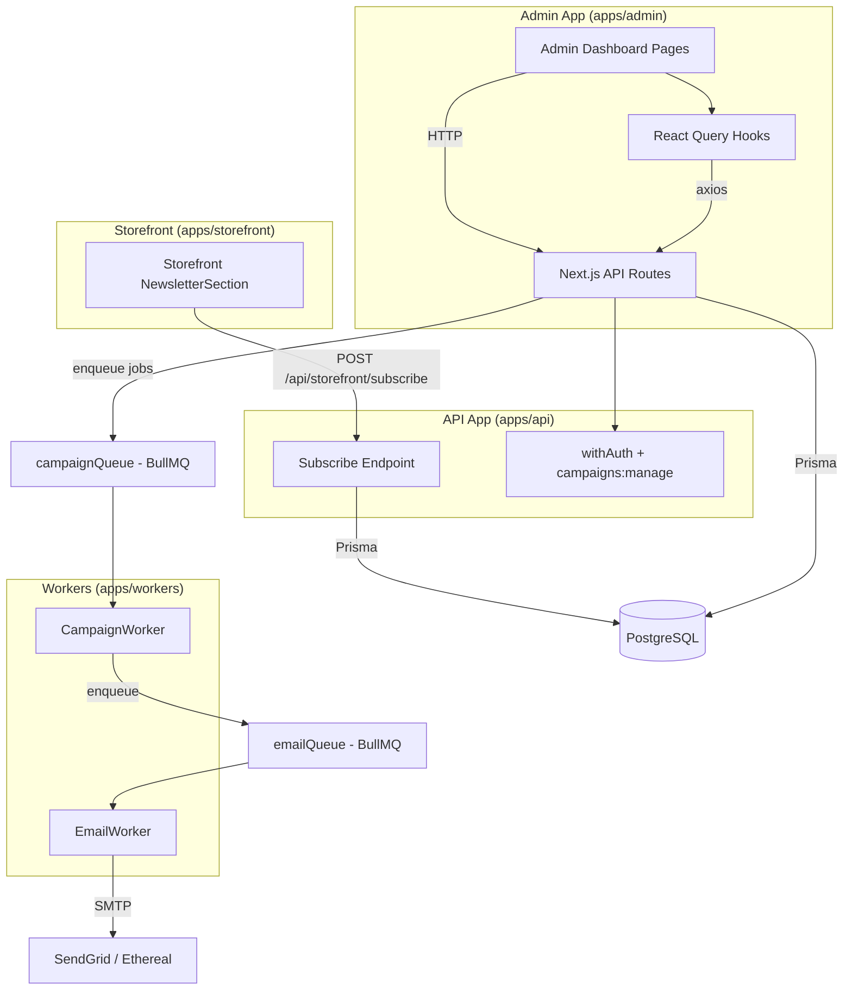
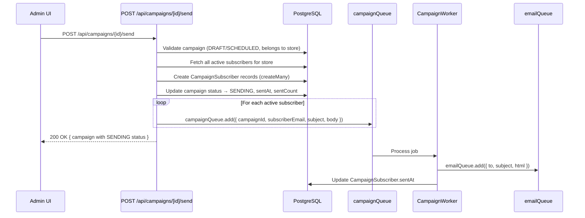
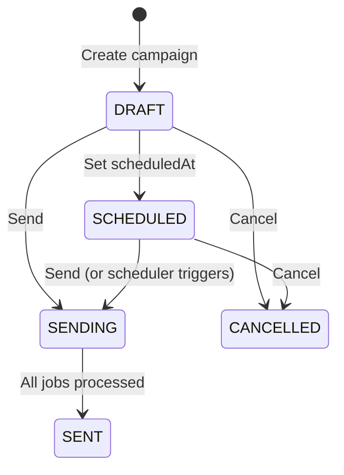

# Design Document: Email Marketing

## Overview

The email marketing feature adds admin-facing CRUD endpoints and UI for managing campaigns and subscribers in the multi-tenant e-commerce platform. The backend infrastructure (Campaign/Subscriber/CampaignSubscriber Prisma models, CampaignWorker, campaignQueue, campaignTemplate, emailQueue) already exists. This feature bridges the gap by providing:

- API endpoints under `apps/api/pages/api/` for campaigns CRUD, subscribers CRUD, CSV import, send/cancel actions, and storefront subscribe
- A new `campaigns:manage` RBAC permission added to `packages/auth/src/rbac.ts`
- Admin React Query hooks (`useCampaigns`, `useSubscribers`, etc.) following the existing `useProducts` pattern
- Dashboard pages for email marketing overview, subscriber management, and campaign management
- Wiring the existing `NewsletterSection` storefront component to the new `/api/storefront/subscribe` endpoint

The send flow enqueues one `CampaignJobData` job per active subscriber into the existing `campaignQueue`, which the `CampaignWorker` picks up to dispatch emails via `emailQueue`. Campaign status transitions follow: DRAFT → SENDING → SENT (or DRAFT → SCHEDULED → SENDING → SENT), with CANCELLED available from DRAFT/SCHEDULED states.

## Architecture



### Campaign Send Flow



### Campaign Status State Machine



## Components and Interfaces

### Component 1: Subscriber API Endpoints

**Location**: `apps/api/pages/api/subscribers/index.ts`, `apps/api/pages/api/subscribers/[id].ts`, `apps/api/pages/api/subscribers/import.ts`

**Interface**:
```typescript
// GET /api/subscribers?page=1&limit=20&search=term
// → { success: true, data: { subscribers: Subscriber[], total: number, page: number, limit: number } }

// POST /api/subscribers  { email: string, name?: string }
// → 201 { success: true, data: Subscriber }

// PUT /api/subscribers/[id]  { name?: string, active?: boolean }
// → { success: true, data: Subscriber }

// DELETE /api/subscribers/[id]
// → 204 No Content

// POST /api/subscribers/import  (multipart/form-data with CSV file)
// → { success: true, data: { created: number, skipped: number, errors: { row: number, reason: string }[] } }
```

**Responsibilities**:
- Authenticate via `withAuth(handler, 'campaigns:manage')`
- Scope all queries by `tenantId → store.id`
- Validate with Zod schemas
- CSV import: parse `email,name` columns, skip duplicates and invalid emails, return summary

### Component 2: Campaign API Endpoints

**Location**: `apps/api/pages/api/campaigns/index.ts`, `apps/api/pages/api/campaigns/[id].ts`, `apps/api/pages/api/campaigns/[id]/send.ts`, `apps/api/pages/api/campaigns/[id]/cancel.ts`

**Interface**:
```typescript
// GET /api/campaigns?page=1&limit=20&status=DRAFT
// → { success: true, data: { campaigns: Campaign[], total: number, page: number, limit: number } }

// POST /api/campaigns  { name: string, subject: string, body: string, scheduledAt?: string }
// → 201 { success: true, data: Campaign }

// GET /api/campaigns/[id]
// → { success: true, data: Campaign & { _stats: { total: number, sent: number, opened: number, clicked: number } } }

// PUT /api/campaigns/[id]  { name?: string, subject?: string, body?: string }
// → { success: true, data: Campaign }  (only DRAFT campaigns)

// POST /api/campaigns/[id]/send
// → { success: true, data: Campaign }  (only DRAFT/SCHEDULED campaigns)

// POST /api/campaigns/[id]/cancel
// → { success: true, data: Campaign }  (only DRAFT/SCHEDULED campaigns)
```

**Responsibilities**:
- Authenticate via `withAuth(handler, 'campaigns:manage')`
- Scope all queries by `tenantId → store.id`
- Enforce status guards: only DRAFT campaigns can be edited, only DRAFT/SCHEDULED can be sent or cancelled
- Send action: create CampaignSubscriber records, enqueue jobs to `campaignQueue`, update status to SENDING

### Component 3: Storefront Subscribe Endpoint

**Location**: `apps/api/pages/api/storefront/subscribe.ts`

**Interface**:
```typescript
// POST /api/storefront/subscribe  { email: string, storeSlug: string }
// → { success: true, data: { message: string } }
```

**Responsibilities**:
- No authentication required (public endpoint)
- Look up store by `storeSlug`
- Use `upsert` with `[storeId, email]` unique constraint for idempotent behavior
- Validate email format with Zod

### Component 4: RBAC Permission

**Location**: `packages/auth/src/rbac.ts`

**Changes**:
- Add `'campaigns:manage'` to the `Permission` type union
- Add `'campaigns:manage'` to `SUPER_ADMIN`, `ADMIN`, and `MANAGER` role permission arrays

### Component 5: Admin React Query Hooks

**Location**: `apps/admin/hooks/useCampaigns.ts`, `apps/admin/hooks/useSubscribers.ts`

**Interface**:
```typescript
// useCampaigns.ts
function useCampaigns(filters?: { page?: number; status?: string }): UseQueryResult<CampaignsResponse>
function useCampaign(id: string): UseQueryResult<CampaignDetail>
function useCreateCampaign(): UseMutationResult<Campaign, Error, CreateCampaignPayload>
function useUpdateCampaign(id: string): UseMutationResult<Campaign, Error, UpdateCampaignPayload>
function useSendCampaign(): UseMutationResult<Campaign, Error, string>
function useCancelCampaign(): UseMutationResult<Campaign, Error, string>

// useSubscribers.ts
function useSubscribers(filters?: { page?: number; search?: string }): UseQueryResult<SubscribersResponse>
function useCreateSubscriber(): UseMutationResult<Subscriber, Error, CreateSubscriberPayload>
function useUpdateSubscriber(id: string): UseMutationResult<Subscriber, Error, UpdateSubscriberPayload>
function useDeleteSubscriber(): UseMutationResult<void, Error, string>
function useImportSubscribers(): UseMutationResult<ImportResult, Error, File>
```

**Responsibilities**:
- Use `api` from `@/lib/api` (axios with auth interceptor)
- Invalidate relevant query keys on mutation success
- Follow existing pattern: `queryKey: ['campaigns', filters]`, `queryKey: ['subscribers', filters]`

### Component 6: Admin Dashboard Pages

**Pages**:
- `/dashboard/email` — Overview with StatCards (total subscribers, total campaigns sent, overall open rate)
- `/dashboard/email/subscribers` — Subscriber table with search, add, import CSV, edit, delete
- `/dashboard/email/campaigns` — Campaign list with status badges, pagination
- `/dashboard/email/campaigns/new` — Campaign creation form (name, subject, body textarea, optional scheduledAt)
- `/dashboard/email/campaigns/[id]` — Campaign detail with delivery stats, send/cancel buttons

**Responsibilities**:
- Use existing UI components: Topbar, Card, Table, Badge, Button, Input, StatCard
- Follow existing page patterns (see `customers/page.tsx`, `products/page.tsx`)
- Use React Query hooks for data fetching

## Data Models

### Campaign (existing Prisma model)

```typescript
interface Campaign {
  id: string
  storeId: string
  name: string
  subject: string
  body: string              // HTML content for the email body
  status: CampaignStatus    // DRAFT | SCHEDULED | SENDING | SENT | CANCELLED
  scheduledAt: string | null
  sentAt: string | null
  sentCount: number
  createdAt: string
}
```

### Subscriber (existing Prisma model)

```typescript
interface Subscriber {
  id: string
  email: string
  name: string | null
  storeId: string
  active: boolean
  createdAt: string
}
```

### CampaignSubscriber (existing junction)

```typescript
interface CampaignSubscriber {
  campaignId: string
  subscriberId: string
  sentAt: string | null
  openedAt: string | null
  clickedAt: string | null
}
```

### Zod Validation Schemas

```typescript
// Subscriber
const createSubscriberSchema = z.object({
  email: z.string().email('Email inválido'),
  name: z.string().optional(),
})

const updateSubscriberSchema = z.object({
  name: z.string().optional(),
  active: z.boolean().optional(),
})

// Campaign
const createCampaignSchema = z.object({
  name: z.string().min(2, 'Nome deve ter pelo menos 2 caracteres'),
  subject: z.string().min(2, 'Assunto deve ter pelo menos 2 caracteres'),
  body: z.string().min(1, 'Corpo do email é obrigatório'),
  scheduledAt: z.string().datetime().optional().refine(
    (val) => !val || new Date(val) > new Date(),
    'Data de agendamento deve ser no futuro'
  ),
})

const updateCampaignSchema = z.object({
  name: z.string().min(2).optional(),
  subject: z.string().min(2).optional(),
  body: z.string().min(1).optional(),
})

// Storefront subscribe
const subscribeSchema = z.object({
  email: z.string().email('Email inválido'),
  storeSlug: z.string().min(1),
})
```

### API Response Types

```typescript
interface CampaignsResponse {
  campaigns: Campaign[]
  total: number
  page: number
  limit: number
}

interface CampaignDetail extends Campaign {
  _stats: { total: number; sent: number; opened: number; clicked: number }
}

interface SubscribersResponse {
  subscribers: Subscriber[]
  total: number
  page: number
  limit: number
}

interface ImportResult {
  created: number
  skipped: number
  errors: { row: number; reason: string }[]
}
```

## Correctness Properties

*A property is a characteristic or behavior that should hold true across all valid executions of a system — essentially, a formal statement about what the system should do. Properties serve as the bridge between human-readable specifications and machine-verifiable correctness guarantees.*

### Property 1: Store isolation

*For any* API request to subscriber or campaign endpoints, all returned records SHALL have a `storeId` matching the authenticated user's store, and any mutation targeting a record belonging to a different store SHALL return 404.

**Validates: Requirements 1.1, 1.7, 3.1, 3.8**

### Property 2: Subscriber uniqueness and idempotent subscribe

*For any* valid email and storeId, creating a subscriber when one already exists with the same `[storeId, email]` SHALL return 409 on the admin endpoint, and the storefront subscribe endpoint SHALL return success without creating a duplicate — in both cases the database SHALL contain exactly one subscriber record for that `[storeId, email]` pair.

**Validates: Requirements 1.5, 5.1, 5.2**

### Property 3: Campaign creation default status

*For any* valid campaign creation payload, if `scheduledAt` is not provided the campaign SHALL have status `DRAFT`, and if `scheduledAt` is provided with a future date the campaign SHALL have status `SCHEDULED`. In both cases `sentCount` SHALL be 0 and `sentAt` SHALL be null.

**Validates: Requirements 3.3, 3.4**

### Property 4: Campaign status transition guards

*For any* campaign, the send action SHALL succeed only when status is `DRAFT` or `SCHEDULED`, the cancel action SHALL succeed only when status is `DRAFT` or `SCHEDULED`, and content updates (name/subject/body) SHALL succeed only when status is `DRAFT`. All other status combinations SHALL return 400.

**Validates: Requirements 3.7, 4.3, 4.6**

### Property 5: Send completeness

*For any* DRAFT or SCHEDULED campaign in a store with N active subscribers (N > 0), after the send action completes: the campaign SHALL have status `SENDING`, exactly N `CampaignSubscriber` records SHALL exist for that campaign, `sentCount` SHALL equal N, and exactly N jobs SHALL be enqueued in `campaignQueue`.

**Validates: Requirements 4.1, 4.2**

### Property 6: CSV import invariant

*For any* CSV file with a valid `email` column header and R total data rows, the import response SHALL satisfy: `created + skipped + errors.length === R`, where `created` is the count of new subscribers added, `skipped` is the count of duplicate emails, and `errors` contains rows with invalid email format including their row numbers.

**Validates: Requirements 2.1, 2.2, 2.3, 2.4**

### Property 7: Zod validation rejects invalid input

*For any* request body that fails Zod schema validation (invalid email format, missing required campaign fields, past `scheduledAt` date), the API SHALL return a 400 response containing structured error details, and no database records SHALL be created or modified.

**Validates: Requirements 9.1, 9.2, 9.3, 9.4, 9.5**

### Property 8: Permission enforcement

*For any* user with a role that does not have the `campaigns:manage` permission (VENDOR, AFFILIATE, CUSTOMER), all requests to subscriber and campaign endpoints SHALL return 403 Forbidden.

**Validates: Requirements 8.3, 8.4**

## Error Handling

| Scenario | Condition | HTTP Status | Message | Recovery |
|---|---|---|---|---|
| No active subscribers | Send triggered but store has 0 active subscribers | 400 | "Nenhum assinante ativo encontrado" | Add active subscribers first |
| Duplicate subscriber email | POST /api/subscribers with existing email for store | 409 | "Email já cadastrado" | Update existing subscriber |
| Send non-sendable campaign | Send on SENDING/SENT/CANCELLED campaign | 400 | "Campanha não pode ser enviada no status atual" | Create new campaign |
| Edit non-draft campaign | PUT on non-DRAFT campaign | 400 | "Apenas campanhas em rascunho podem ser editadas" | Create new campaign |
| Cancel non-cancellable | Cancel on SENDING/SENT/CANCELLED campaign | 400 | "Campanha não pode ser cancelada no status atual" | N/A |
| Record not found / wrong store | ID doesn't exist or belongs to different store | 404 | "Não encontrado" | Redirect to list |
| Invalid CSV format | Missing `email` column header | 400 | "Coluna 'email' não encontrada no CSV" | Fix CSV format |
| Zod validation failure | Any invalid request body | 400 | Zod error details | Fix input |
| Unauthenticated | Missing or invalid JWT | 401 | "Não autorizado" | Re-login |
| Unauthorized | Role lacks `campaigns:manage` | 403 | "Acesso negado" | Contact admin |

## Testing Strategy

### Property-Based Testing

**Library**: fast-check

Each correctness property from the design document will be implemented as a property-based test with minimum 100 iterations. Tests will use mocked Prisma client and mocked campaignQueue to test pure logic without external dependencies.

**Tag format**: `Feature: email-marketing, Property {number}: {title}`

Key property tests:
- Store isolation: generate random multi-store data, verify scoping
- Subscriber uniqueness: generate random emails, verify constraint enforcement
- Campaign status transitions: generate random status + action combinations, verify guards
- Send completeness: generate random subscriber sets, verify CampaignSubscriber and job counts
- CSV import invariant: generate random CSV data, verify `created + skipped + errors = total`
- Validation rejection: generate random invalid payloads, verify 400 responses

### Unit Tests

- Zod schema validation for each endpoint (valid and invalid inputs)
- Campaign status state machine transitions
- CSV parsing logic (valid rows, invalid emails, missing headers, duplicates)
- Response helper usage (correct HTTP status codes)

### Integration Tests

- Full send flow: create campaign → add subscribers → send → verify queue jobs
- Storefront subscribe: public endpoint without auth → subscriber created
- RBAC enforcement: verify each role gets correct 200/403 response
- Pagination and filtering on list endpoints
