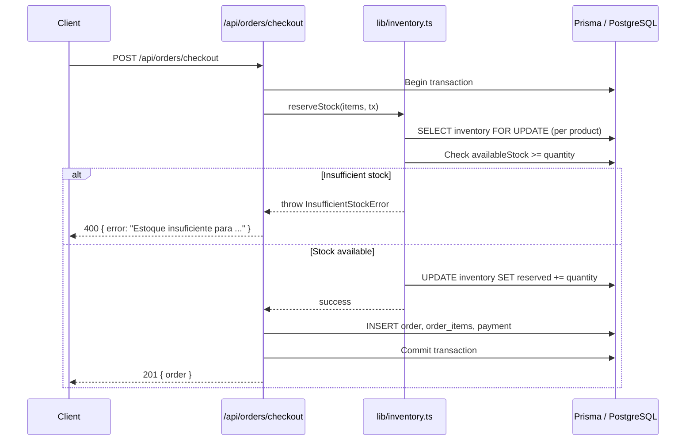

# Design Document: ERP Inventory Management

## Overview

This feature adds inventory management capabilities to the existing e-commerce platform. It introduces API endpoints for inventory CRUD, warehouse management, stock movements, and low stock alerts. It also modifies the existing checkout, payment webhook, and order update flows to integrate stock reservation, fulfillment, and release. Finally, it adds admin dashboard pages for inventory visibility.

The Prisma schema already defines `Inventory`, `Warehouse`, and `StockMovement` models. Product creation already creates an `Inventory` record with `quantity: 0`. This design builds on those foundations without schema changes.

### Key Design Decisions

1. **Reuse existing permissions**: Inventory endpoints use `products:read` and `products:write` rather than introducing new permission types. Inventory is a property of products, so this is a natural fit.
2. **Transactional stock operations**: All stock mutations (reservation, fulfillment, release, adjustment) use Prisma interactive transactions (`prisma.$transaction`) to guarantee atomicity.
3. **Shared inventory service**: A `lib/inventory.ts` module encapsulates stock reservation, fulfillment, and release logic. Both checkout and webhooks call into this module rather than duplicating logic.
4. **Store-scoped queries**: All inventory API queries are scoped to the authenticated user's tenant store, matching the existing multi-tenant pattern.
5. **Available stock computed at query time**: `availableStock = quantity - reserved` is computed in API responses, not stored as a column, to avoid sync issues.

## Architecture

```mermaid
graph TD
    subgraph Admin Frontend
        A[Inventory Dashboard] --> B[useInventory hooks]
        B --> C[api.ts axios client]
    end

    subgraph API Layer
        C --> D[/api/inventory]
        C --> E[/api/warehouses]
        C --> F[/api/inventory/alerts]
        G[/api/orders/checkout] --> H[lib/inventory.ts]
        I[/api/webhooks/stripe] --> H
        J[/api/webhooks/mercadopago] --> H
        K[/api/orders/id] --> H
        D --> L[Prisma Client]
        E --> L
        F --> L
        H --> L
    end

    subgraph Database
        L --> M[(Inventory)]
        L --> N[(Warehouse)]
        L --> O[(StockMovement)]
        L --> P[(Product)]
        L --> Q[(Order / OrderItem)]
    end
```

### Request Flow: Checkout with Stock Reservation



## Components and Interfaces

### 1. Inventory Service (`apps/api/lib/inventory.ts`)

Shared module for stock operations, used by checkout, webhooks, and order update handlers.

```typescript
// Reserve stock for order items (called during checkout)
async function reserveStock(
  items: { productId: string; quantity: number }[],
  tx: PrismaTransactionClient
): Promise<void>

// Fulfill stock after payment confirmation (decrement quantity + reserved, create OUT movements)
async function fulfillStock(
  orderId: string,
  items: { productId: string; quantity: number }[],
  tx: PrismaTransactionClient
): Promise<void>

// Release reserved stock on cancellation (decrement reserved, create RETURN movements)
async function releaseStock(
  orderId: string,
  items: { productId: string; quantity: number }[],
  tx: PrismaTransactionClient
): Promise<void>

// Restore fulfilled stock on cancellation after payment (increment quantity, create RETURN movements)
async function restoreStock(
  orderId: string,
  items: { productId: string; quantity: number }[],
  tx: PrismaTransactionClient
): Promise<void>
```

### 2. API Endpoints

#### Inventory Endpoints (`apps/api/pages/api/inventory/`)

| Method | Path | Permission | Description |
|--------|------|------------|-------------|
| GET | `/api/inventory` | `products:read` | List inventory with pagination, search, warehouse filter, low stock filter |
| PUT | `/api/inventory/[productId]` | `products:write` | Update lowStockAlert and warehouseId |
| POST | `/api/inventory/[productId]/adjust` | `products:write` | Manual stock adjustment (IN/OUT/ADJUSTMENT) |
| GET | `/api/inventory/[productId]/movements` | `products:read` | List stock movements with pagination and type filter |
| GET | `/api/inventory/alerts` | `products:read` | List low stock products ordered by urgency |

#### Warehouse Endpoints (`apps/api/pages/api/warehouses/`)

| Method | Path | Permission | Description |
|--------|------|------------|-------------|
| GET | `/api/warehouses` | `products:read` | List all warehouses |
| POST | `/api/warehouses` | `products:write` | Create warehouse |
| PUT | `/api/warehouses/[id]` | `products:write` | Update warehouse |
| DELETE | `/api/warehouses/[id]` | `products:write` | Delete warehouse (409 if inventory assigned) |

#### Modified Endpoints

| Endpoint | Change |
|----------|--------|
| `POST /api/orders/checkout` | Add stock reservation via `reserveStock()` inside transaction |
| `PUT /api/orders/[id]` | Add stock release via `releaseStock()` or `restoreStock()` when status changes to CANCELLED |
| `POST /api/webhooks/stripe` | Add stock fulfillment via `fulfillStock()` on `payment_intent.succeeded` |
| `POST /api/webhooks/mercadopago` | Add stock fulfillment via `fulfillStock()` on payment approval |

### 3. Admin Hooks (`apps/admin/hooks/useInventory.ts`)

```typescript
// List inventory with filters
function useInventory(filters: { page?: number; limit?: number; search?: string; warehouseId?: string; lowStock?: boolean })

// Get single product inventory detail
function useProductInventory(productId: string)

// Update inventory settings (lowStockAlert, warehouseId)
function useUpdateInventory(productId: string)

// Adjust stock (IN/OUT/ADJUSTMENT)
function useAdjustStock(productId: string)

// List stock movements for a product
function useStockMovements(productId: string, filters: { page?: number; limit?: number; type?: string })

// List low stock alerts
function useInventoryAlerts()

// List warehouses
function useWarehouses()

// Create warehouse
function useCreateWarehouse()

// Update warehouse
function useUpdateWarehouse(id: string)

// Delete warehouse
function useDeleteWarehouse()
```

### 4. Admin Pages

| Path | Component | Description |
|------|-----------|-------------|
| `/dashboard/inventory` | `InventoryPage` | Overview with stat cards (total products, low stock count, stock value) and recent movements |
| `/dashboard/inventory/products` | `InventoryProductsPage` | Paginated table of products with inventory data, search, low stock badges |
| `/dashboard/inventory/products/[id]` | `InventoryProductDetailPage` | Product inventory detail, movement history table, adjustment form, settings form |
| `/dashboard/inventory/warehouses` | `WarehousesPage` | Warehouse list with create/edit/delete |
| `/dashboard/inventory/alerts` | `AlertsPage` | Low stock products ordered by urgency |

## Data Models

The Prisma schema already defines all required models. No schema changes are needed.

### Existing Models Used

**Inventory**
| Field | Type | Description |
|-------|------|-------------|
| id | String (cuid) | Primary key |
| productId | String (unique) | FK to Product |
| quantity | Int (default 0) | Total physical stock |
| reserved | Int (default 0) | Stock reserved by pending orders |
| lowStockAlert | Int (default 5) | Threshold for low stock alerts |
| warehouseId | String? | FK to Warehouse (optional) |
| updatedAt | DateTime | Auto-updated timestamp |

**Warehouse**
| Field | Type | Description |
|-------|------|-------------|
| id | String (cuid) | Primary key |
| name | String | Warehouse name |
| address | String | Street address |
| city | String | City |
| state | String | State |
| zipCode | String | Zip code |
| active | Boolean (default true) | Whether warehouse is active |

**StockMovement**
| Field | Type | Description |
|-------|------|-------------|
| id | String (cuid) | Primary key |
| inventoryId | String | FK to Inventory |
| type | MovementType | IN, OUT, ADJUSTMENT, RETURN |
| quantity | Int | Amount changed (always positive; type indicates direction) |
| reason | String? | Human-readable reason for the movement |
| orderId | String? | Associated order ID (for fulfillment/release) |
| createdAt | DateTime | Timestamp |

### Computed Values

- **Available Stock**: `quantity - reserved` — computed in API responses, not stored
- **Low Stock**: `quantity <= lowStockAlert` — evaluated at query time
- **Stock Value**: `SUM(inventory.quantity * product.price)` — computed for dashboard stats

### Key Validation Rules

| Rule | Enforcement |
|------|-------------|
| OUT adjustment cannot make quantity negative | API validation before update |
| Reservation cannot exceed available stock | Check `quantity - reserved >= requestedQty` |
| Warehouse delete blocked if inventory assigned | API returns 409 |
| Warehouse must exist and be active for assignment | API validation on PUT |
| Stock operations are atomic | Prisma `$transaction` |


## Correctness Properties

*A property is a characteristic or behavior that should hold true across all valid executions of a system — essentially, a formal statement about what the system should do. Properties serve as the bridge between human-readable specifications and machine-verifiable correctness guarantees.*

### Property 1: Available stock is always quantity minus reserved

*For any* Inventory record with any non-negative `quantity` and `reserved` values where `reserved <= quantity`, the computed `availableStock` returned by the inventory list and detail endpoints SHALL equal `quantity - reserved`.

**Validates: Requirements 1.1**

### Property 2: Search filter returns only matching products

*For any* set of products and any search string, the inventory list filtered by that search string SHALL return only products whose name contains the search string (case-insensitive), and SHALL not exclude any product whose name contains the search string.

**Validates: Requirements 1.2**

### Property 3: Warehouse filter returns only products in that warehouse

*For any* set of inventory records assigned to various warehouses and any valid warehouseId, the inventory list filtered by that warehouseId SHALL return only products assigned to that warehouse.

**Validates: Requirements 1.3**

### Property 4: Low stock filter returns exactly products at or below threshold

*For any* set of inventory records with varying `quantity` and `lowStockAlert` values, the low stock filter SHALL return exactly those products where `quantity <= lowStockAlert`, and SHALL not include products where `quantity > lowStockAlert`.

**Validates: Requirements 1.4, 6.1**

### Property 5: Low stock alerts are ordered by urgency

*For any* set of low stock inventory records, the alerts endpoint SHALL return them ordered by `(quantity - lowStockAlert)` ascending, so that the most critically low items appear first.

**Validates: Requirements 6.3**

### Property 6: Stock adjustment produces correct quantity and movement

*For any* Inventory record with quantity Q and any valid adjustment:
- If type is IN with amount A, the resulting quantity SHALL be Q + A and a StockMovement with quantity A SHALL be created.
- If type is OUT with amount A where A <= Q, the resulting quantity SHALL be Q - A and a StockMovement with quantity A SHALL be created.
- If type is OUT with amount A where A > Q, the adjustment SHALL be rejected and quantity SHALL remain Q.
- If type is ADJUSTMENT with target T, the resulting quantity SHALL be T and a StockMovement with quantity |T - Q| SHALL be created.

**Validates: Requirements 3.1, 3.2, 3.3, 3.4, 3.5**

### Property 7: Stock reservation is all-or-nothing and correct

*For any* set of order items and corresponding inventory records:
- If all items have `availableStock >= orderedQuantity`, then after reservation, each product's `reserved` field SHALL have increased by exactly the ordered quantity, and `quantity` SHALL be unchanged.
- If any item has `availableStock < orderedQuantity`, then no product's `reserved` field SHALL change and the operation SHALL be rejected.

**Validates: Requirements 7.1, 7.2, 7.4**

### Property 8: Stock fulfillment decrements correctly and creates movements

*For any* order with items and corresponding inventory records that have sufficient reserved stock, after fulfillment:
- Each product's `quantity` SHALL have decreased by the ordered quantity.
- Each product's `reserved` SHALL have decreased by the ordered quantity.
- An OUT StockMovement SHALL exist for each item with the correct quantity and orderId.

**Validates: Requirements 8.1, 8.2, 8.3**

### Property 9: Stock release on cancellation restores reserved stock

*For any* pending order (not yet fulfilled) with items, after cancellation:
- Each product's `reserved` SHALL have decreased by the ordered quantity.
- Each product's `quantity` SHALL be unchanged.
- A RETURN StockMovement SHALL exist for each item with the correct quantity and orderId.

**Validates: Requirements 9.1, 9.2**

### Property 10: Stock restore on cancellation after fulfillment

*For any* fulfilled order (payment confirmed, stock already decremented) with items, after cancellation:
- Each product's `quantity` SHALL have increased by the ordered quantity.
- A RETURN StockMovement SHALL exist for each item with the correct quantity and orderId.

**Validates: Requirements 9.4**

## Error Handling

### API Error Responses

All error responses follow the existing pattern from `lib/response.ts`:

```json
{ "success": false, "error": "Human-readable error message" }
```

| Scenario | Status | Message |
|----------|--------|---------|
| Product has no inventory record | 404 | "Inventário não encontrado" |
| OUT adjustment would make quantity negative | 400 | "Estoque insuficiente para esta operação" |
| Insufficient stock during checkout | 400 | "Estoque insuficiente para {productName}" |
| Warehouse not found or inactive | 400 | "Armazém não encontrado ou inativo" |
| Warehouse has assigned inventory on delete | 409 | "Armazém possui inventário atribuído" |
| Warehouse not found | 404 | "Armazém não encontrado" |
| Invalid adjustment type | 400 | Zod validation error |
| Missing required fields | 400 | Zod validation error |
| Unauthorized | 401 | "Não autorizado" |
| Insufficient permissions | 403 | "Acesso negado" |

### Transaction Error Recovery

- All stock mutations use Prisma `$transaction`. If any step fails, the entire operation rolls back.
- Webhook handlers catch errors and return 200 to avoid retries from payment providers for non-transient errors. Transient errors (DB connection) will naturally retry via the provider's retry mechanism.

### Edge Cases

- **Product without inventory record**: The product creation flow already creates an Inventory record. API endpoints return 404 if somehow missing.
- **Concurrent stock operations**: Prisma transactions with row-level reads provide sufficient isolation for typical e-commerce traffic. For high-concurrency scenarios, the `reserveStock` function reads inventory within the transaction, which PostgreSQL handles with MVCC.
- **Double fulfillment**: The webhook handlers should check if the order is already CONFIRMED before fulfilling. If already fulfilled, skip the inventory update.
- **Cancellation of already-cancelled order**: Check current order status before releasing stock. If already CANCELLED, skip.

## Testing Strategy

### Property-Based Tests

Property-based tests will use **fast-check** for TypeScript. Each property test runs a minimum of 100 iterations.

The inventory service (`lib/inventory.ts`) contains pure business logic that is ideal for PBT:
- Stock adjustment calculations (Property 6)
- Reservation logic with all-or-nothing semantics (Property 7)
- Fulfillment arithmetic (Property 8)
- Release/restore logic (Properties 9, 10)
- Filter and computation logic (Properties 1-5)

Each property test will be tagged with:
```
// Feature: erp-inventory, Property {N}: {property_text}
```

### Unit Tests (Example-Based)

Unit tests cover specific scenarios, edge cases, and API integration points:

- **Inventory API**: GET list with various filter combinations, PUT update with valid/invalid data, 404 for missing inventory
- **Warehouse API**: Full CRUD cycle, 409 on delete with assigned inventory, 404 for missing warehouse
- **Movement API**: Pagination, type filtering, ordering, 404 for missing inventory
- **Alerts API**: Response shape, empty results
- **Auth**: Permission checks for each endpoint (products:read vs products:write)
- **Checkout integration**: Successful reservation, insufficient stock rejection, partial stock failure (all-or-nothing)
- **Webhook integration**: Fulfillment on payment success, idempotent handling of duplicate events
- **Order cancellation**: Release for pending orders, restore for fulfilled orders, no-op for already cancelled

### Admin Component Tests

- Render tests for each page with mocked API responses
- Verify table columns, stat cards, forms, and navigation links
- Verify low stock badge rendering
- Verify error message display on failed operations

### Test File Structure

```
apps/api/tests/
  inventory/
    inventory.test.ts          # Inventory list, update, adjust API tests
    inventory.property.test.ts # Property-based tests for inventory service
    movements.test.ts          # Movement history API tests
    alerts.test.ts             # Low stock alerts API tests
  warehouses/
    warehouses.test.ts         # Warehouse CRUD API tests
  orders/
    checkout-inventory.test.ts # Checkout stock reservation tests
    cancel-inventory.test.ts   # Order cancellation stock release tests
  webhooks/
    fulfillment.test.ts        # Payment webhook fulfillment tests
apps/admin/tests/
  inventory/
    inventory-page.test.tsx    # Dashboard overview page tests
    products-page.test.tsx     # Products list page tests
    detail-page.test.tsx       # Product detail page tests
    warehouses-page.test.tsx   # Warehouse management page tests
    alerts-page.test.tsx       # Alerts page tests
```
