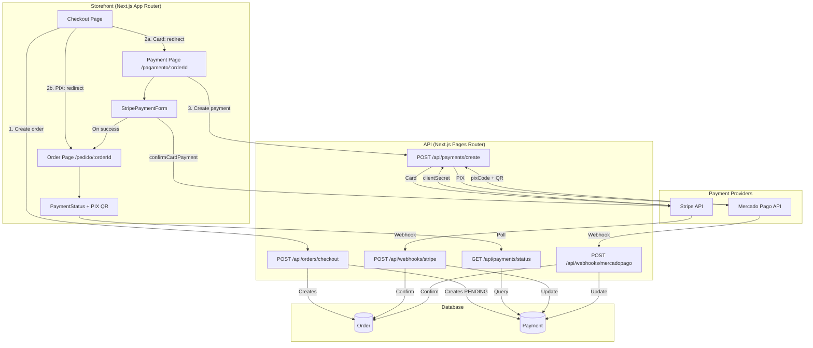
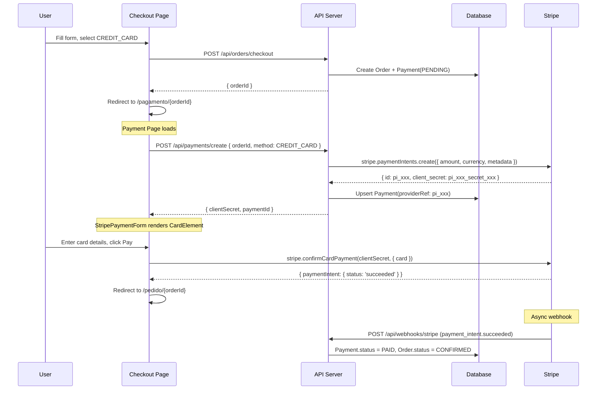
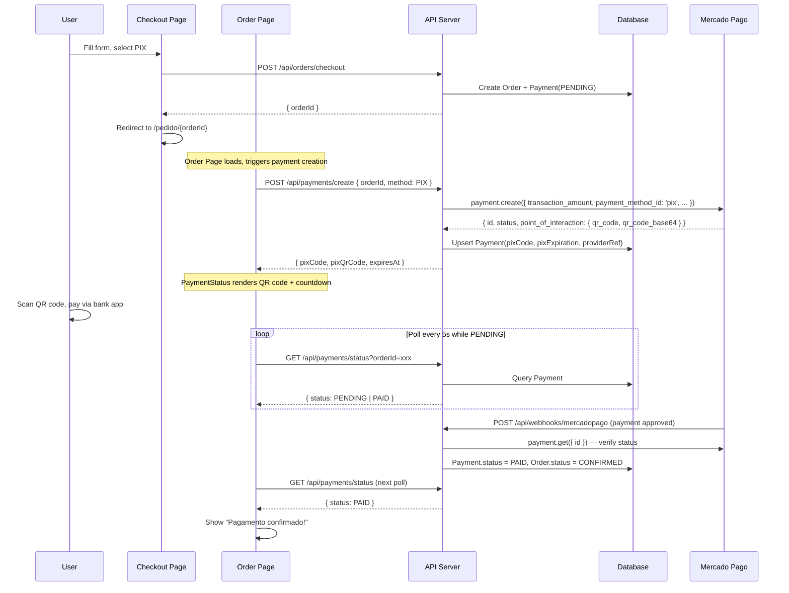

# Design Document: Real Payments Integration

## Overview

The e-commerce platform (Reino Flor) currently has a complete payment infrastructure with mock implementations for both Stripe (credit/debit cards) and Mercado Pago (PIX, boleto). Real sandbox API keys are now available, and the system needs to transition from mocks to real provider integrations.

This feature covers three areas: (1) fixing the backend Stripe mock detection logic to support restricted API keys (`rk_test_...`), (2) adding Stripe Elements to the storefront for credit card payments, and (3) enhancing the PIX payment flow with QR code rendering and expiration countdown. The backend payment creation, webhook handling, and status polling APIs already exist and require minimal changes.

The architecture follows a two-phase payment model: checkout creates the order, then a separate payment creation call initializes the provider-specific payment flow. Webhooks asynchronously confirm payment status.

## Architecture



## Sequence Diagrams

### Credit Card Payment Flow



### PIX Payment Flow



## Components and Interfaces

### Component 1: Stripe Mock Detection Fix (Backend)

**Purpose**: Update `getStripe()` to correctly detect real keys including restricted keys (`rk_test_...`), instead of only checking for `sk_test_` prefix.

**Current Interface** (broken):
```typescript
// apps/api/lib/payments/stripe.ts
function getStripe(): Stripe {
  const key = process.env.STRIPE_SECRET_KEY
  if (!key || key === 'sk_test_MOCK') {
    return createStripeMock()  // BUG: rk_test_51xxx is truthy and !== 'sk_test_MOCK', but still hits mock
  }
  // Actually this works — the bug is the opposite: "sk_test_MOCK" is the only mock sentinel
  // Real issue: key "rk_test_..." will pass through and create real Stripe instance ✓
  // BUT: if someone sets key to just "MOCK", it won't be caught
}
```

**Fixed Interface**:
```typescript
function getStripe(): Stripe {
  const key = process.env.STRIPE_SECRET_KEY
  if (!key || key.includes('MOCK')) {
    return createStripeMock()
  }
  _stripe = new Stripe(key)
  return _stripe
}
```

**Responsibilities**:
- Return mock Stripe client when no key or key contains "MOCK"
- Return real Stripe client for any valid key (`sk_test_...`, `rk_test_...`, `sk_live_...`)
- Cache the real Stripe instance for reuse

### Component 2: StripePaymentForm (Frontend)

**Purpose**: React component that renders Stripe Elements CardElement and handles payment confirmation.

**Interface**:
```typescript
// apps/storefront/components/ui/StripePaymentForm.tsx
interface StripePaymentFormProps {
  clientSecret: string
  orderId: string
  amount: number
}

function StripePaymentForm(props: StripePaymentFormProps): JSX.Element
```

**Responsibilities**:
- Wrap content in Stripe `Elements` provider with `clientSecret`
- Render `CardElement` with Brazilian-friendly styling
- Handle `stripe.confirmCardPayment()` on form submit
- Show loading state during payment processing
- Show error messages from Stripe validation
- Redirect to `/pedido/{orderId}` on successful payment

### Component 3: Payment Page (Frontend)

**Purpose**: New route `/pagamento/[orderId]` that fetches the payment clientSecret and renders StripePaymentForm.

**Interface**:
```typescript
// apps/storefront/app/pagamento/[orderId]/page.tsx
export default function PagamentoPage(): JSX.Element
```

**Responsibilities**:
- Extract `orderId` from URL params
- Call `POST /api/payments/create` with `{ orderId, method: 'CREDIT_CARD' }`
- Pass returned `clientSecret` to `StripePaymentForm`
- Handle loading and error states
- Show order summary alongside payment form

### Component 4: Enhanced PaymentStatus with QR Code (Frontend)

**Purpose**: Upgrade existing `PaymentStatus` component to render the base64 QR code image from Mercado Pago and show a countdown timer for PIX expiration.

**Interface**:
```typescript
// apps/storefront/components/ui/PaymentStatus.tsx
interface PaymentStatusProps {
  orderId: string
}

function PaymentStatus(props: PaymentStatusProps): JSX.Element
```

**Responsibilities**:
- Fetch payment status including `pixQrCode` (base64 image) from API
- Render QR code as `` element when available
- Show countdown timer based on `pixExpiration`
- Continue polling every 5s while status is PENDING
- Stop polling and show confirmation when PAID

### Component 5: Stripe Provider Setup (Frontend)

**Purpose**: Initialize Stripe.js with the publishable key and make it available to payment components.

**Interface**:
```typescript
// apps/storefront/lib/stripe.ts
import { loadStripe, Stripe } from '@stripe/stripe-js'

let stripePromise: Promise<Stripe | null>

export function getStripePromise(): Promise<Stripe | null>
```

**Responsibilities**:
- Lazy-load Stripe.js using `NEXT_PUBLIC_STRIPE_PUBLISHABLE_KEY`
- Cache the promise to avoid multiple loads
- Return null if publishable key is not configured

## Data Models

### Payment Record (existing Prisma model)

```typescript
interface Payment {
  id: string
  orderId: string
  provider: 'STRIPE' | 'MERCADO_PAGO' | 'PIX'
  method: 'CREDIT_CARD' | 'DEBIT_CARD' | 'PIX' | 'BOLETO' | 'WALLET'
  amount: number
  status: 'PENDING' | 'PROCESSING' | 'PAID' | 'FAILED' | 'CANCELLED' | 'REFUNDED'
  providerRef: string | null    // Stripe PaymentIntent ID or MP Payment ID
  pixCode: string | null         // PIX copia-e-cola code
  pixExpiration: Date | null     // PIX expiration timestamp
  paidAt: Date | null
  createdAt: Date
  updatedAt: Date
}
```

**Validation Rules**:
- `amount` must be positive
- `providerRef` is set after provider call succeeds
- `pixCode` and `pixExpiration` only set for PIX payments
- `paidAt` only set when status transitions to PAID

### Payment Create Response

```typescript
// Response from POST /api/payments/create
type PaymentCreateResponse =
  | { paymentId: string; method: 'PIX'; pixCode: string; pixQrCode: string; expiresAt: string; amount: number }
  | { paymentId: string; method: 'CREDIT_CARD' | 'DEBIT_CARD'; clientSecret: string; amount: number }
  | { paymentId: string; method: 'BOLETO'; redirectUrl: string; amount: number }
```

### Payment Status Response

```typescript
// Response from GET /api/payments/status
interface PaymentStatusResponse {
  id: string
  status: 'PENDING' | 'PROCESSING' | 'PAID' | 'FAILED' | 'CANCELLED' | 'REFUNDED'
  method: string
  provider: string
  amount: number
  pixCode: string | null
  pixExpiration: string | null
  paidAt: string | null
  createdAt: string
}
```


## Key Functions with Formal Specifications

### Function 1: getStripe()

```typescript
function getStripe(): Stripe
```

**Preconditions:**
- `process.env.STRIPE_SECRET_KEY` is accessible (may be undefined)

**Postconditions:**
- If key is falsy or contains "MOCK" → returns mock Stripe client
- If key is truthy and does not contain "MOCK" → returns real Stripe client initialized with key
- Subsequent calls return the same cached instance (singleton)
- Never throws — mock is the safe fallback

**Loop Invariants:** N/A

### Function 2: createStripePaymentIntent()

```typescript
async function createStripePaymentIntent(params: CreatePaymentIntentParams): Promise<{
  paymentIntentId: string
  clientSecret: string
}>
```

**Preconditions:**
- `params.amount > 0` (in BRL, e.g., 159.90)
- `params.orderId` is a valid, non-empty string
- Stripe client is initialized (real or mock)

**Postconditions:**
- Returns object with `paymentIntentId` (Stripe PI ID) and `clientSecret`
- Amount sent to Stripe is `Math.round(params.amount * 100)` (converted to centavos)
- `metadata.orderId` is set on the PaymentIntent for webhook correlation
- If Stripe API fails, exception propagates to caller

**Loop Invariants:** N/A

### Function 3: createPixPayment()

```typescript
async function createPixPayment(params: CreatePixParams): Promise<{
  id: string
  status: string
  pixCode: string | undefined
  pixQrCode: string | undefined
  expiresAt: Date
}>
```

**Preconditions:**
- `params.amount > 0`
- `params.orderId` is non-empty
- `params.payerEmail` is a valid email
- Mercado Pago client is initialized (real or mock)

**Postconditions:**
- Returns PIX payment with `pixCode` (copia-e-cola) and `pixQrCode` (base64 PNG)
- `expiresAt` is approximately 30 minutes from creation
- `external_reference` on MP payment is set to `orderId` for webhook correlation
- For mock: returns deterministic mock data with "MOCK" markers

**Loop Invariants:** N/A

### Function 4: stripe.confirmCardPayment() (Frontend)

```typescript
// Called in StripePaymentForm
const result = await stripe.confirmCardPayment(clientSecret, {
  payment_method: { card: cardElement }
})
```

**Preconditions:**
- `clientSecret` is a valid Stripe PaymentIntent client secret
- `cardElement` is a mounted Stripe CardElement with user input
- Stripe.js is loaded with valid publishable key

**Postconditions:**
- If card is valid and payment succeeds: `result.paymentIntent.status === 'succeeded'`
- If card is declined: `result.error` contains decline reason
- If 3D Secure required: Stripe handles the modal automatically
- Webhook fires asynchronously to update backend payment status

**Loop Invariants:** N/A

## Algorithmic Pseudocode

### Checkout → Payment Flow Algorithm

```typescript
// Full flow from checkout to payment confirmation

ALGORITHM checkoutAndPay(formData: CheckoutForm)
INPUT: formData containing items, paymentMethod, address, coupon
OUTPUT: User sees payment confirmation

BEGIN
  // Phase 1: Create Order
  const order = await api.post('/api/orders/checkout', {
    storeSlug: STORE_SLUG,
    items: formData.items,
    paymentMethod: formData.paymentMethod,
    shippingCost: SHIPPING,
    couponCode: formData.couponCode,
  })
  // ASSERT: order.payment.status === 'PENDING'

  // Phase 2: Route based on payment method
  IF formData.paymentMethod === 'CREDIT_CARD' OR formData.paymentMethod === 'DEBIT_CARD' THEN
    // Redirect to card payment page
    router.push(`/pagamento/${order.id}`)
    // Payment page will:
    //   1. POST /api/payments/create → get clientSecret
    //   2. Render StripePaymentForm with clientSecret
    //   3. User enters card → confirmCardPayment
    //   4. On success → redirect to /pedido/{orderId}
  ELSE IF formData.paymentMethod === 'PIX' THEN
    // Redirect to order page (which handles PIX inline)
    router.push(`/pedido/${order.id}`)
    // Order page will:
    //   1. POST /api/payments/create → get pixCode + pixQrCode
    //   2. Render QR code + copy button + countdown
    //   3. Poll status every 5s until PAID
  ELSE
    // Boleto/Wallet: redirect to MP checkout
    router.push(`/pedido/${order.id}`)
  END IF
END
```

### Stripe Webhook Verification Algorithm

```typescript
ALGORITHM handleStripeWebhook(rawBody: Buffer, signature: string)
INPUT: Raw request body and Stripe-Signature header
OUTPUT: Payment and Order status updated in database

BEGIN
  // Step 1: Verify webhook signature
  const event = stripe.webhooks.constructEvent(rawBody, signature, WEBHOOK_SECRET)
  // ASSERT: event is cryptographically verified

  // Step 2: Handle event type
  SWITCH event.type
    CASE 'payment_intent.succeeded':
      const orderId = event.data.object.metadata.orderId
      ASSERT orderId IS NOT NULL

      UPDATE Payment SET status = 'PAID', paidAt = NOW()
        WHERE providerRef = event.data.object.id
      UPDATE Order SET status = 'CONFIRMED'
        WHERE id = orderId

    CASE 'payment_intent.payment_failed':
      UPDATE Payment SET status = 'FAILED'
        WHERE providerRef = event.data.object.id

    CASE 'charge.refunded':
      UPDATE Payment SET status = 'REFUNDED'
        WHERE providerRef = event.data.object.payment_intent
  END SWITCH

  RETURN { received: true }
END
```

### PIX Countdown Timer Algorithm

```typescript
ALGORITHM pixCountdown(expiresAt: Date)
INPUT: PIX expiration timestamp
OUTPUT: Renders countdown, triggers expiration UI when time runs out

BEGIN
  LOOP every 1 second
    const remaining = expiresAt.getTime() - Date.now()

    IF remaining <= 0 THEN
      display "PIX expirado"
      stop polling for payment status
      BREAK
    END IF

    const minutes = Math.floor(remaining / 60000)
    const seconds = Math.floor((remaining % 60000) / 1000)
    display `${minutes}:${seconds.toString().padStart(2, '0')}`
  END LOOP
END
```

## Example Usage

### Stripe Payment Form Usage

```typescript
// apps/storefront/app/pagamento/[orderId]/page.tsx
'use client'

import { useState, useEffect } from 'react'
import { useParams } from 'next/navigation'
import { api } from '@/lib/api'
import { StripePaymentForm } from '@/components/ui/StripePaymentForm'

export default function PagamentoPage() {
  const { orderId } = useParams<{ orderId: string }>()
  const [clientSecret, setClientSecret] = useState<string | null>(null)
  const [amount, setAmount] = useState(0)
  const [error, setError] = useState<string | null>(null)

  useEffect(() => {
    api.post('/api/payments/create', { orderId, method: 'CREDIT_CARD' })
      .then(({ data }) => {
        setClientSecret(data.data.clientSecret)
        setAmount(data.data.amount)
      })
      .catch(() => setError('Erro ao iniciar pagamento'))
  }, [orderId])

  if (error) return <p>{error}</p>
  if (!clientSecret) return <p>Carregando...</p>

  return (
    <StripePaymentForm
      clientSecret={clientSecret}
      orderId={orderId}
      amount={amount}
    />
  )
}
```

### Enhanced PIX QR Code Display

```typescript
// Inside PaymentStatus component
{payment.method === 'PIX' && payment.status === 'PENDING' && (
  <div>
    {/* QR Code Image from Mercado Pago base64 */}
    {payment.pixQrCode && (
      
    )}

    {/* Copy-paste code */}
    <div className="font-mono text-xs break-all">{payment.pixCode}</div>

    {/* Countdown timer */}
    <PixCountdown expiresAt={new Date(payment.pixExpiration)} />
  </div>
)}
```

## Correctness Properties

1. **Mock isolation**: ∀ key ∈ STRIPE_SECRET_KEY: key contains "MOCK" ⟹ getStripe() returns mock client (no real API calls)
2. **Real key activation**: ∀ key ∈ STRIPE_SECRET_KEY: key is truthy ∧ ¬(key contains "MOCK") ⟹ getStripe() returns real Stripe instance
3. **Amount conversion**: ∀ payment: amountSentToStripe === Math.round(orderAmount × 100) (BRL to centavos)
4. **Webhook idempotency**: ∀ webhook event: processing the same event twice produces the same final state
5. **Payment-Order consistency**: ∀ payment: payment.status === 'PAID' ⟹ payment.order.status === 'CONFIRMED'
6. **PIX expiration**: ∀ PIX payment: expiresAt > createdAt ∧ (expiresAt - createdAt) ≈ 30 minutes
7. **Client secret isolation**: ∀ clientSecret returned by API: clientSecret is only usable with the matching NEXT_PUBLIC_STRIPE_PUBLISHABLE_KEY
8. **Polling termination**: ∀ PaymentStatus component: polling stops when status ∉ { 'PENDING' }
9. **Redirect correctness**: ∀ card payment: method === 'CREDIT_CARD' ⟹ user is redirected to /pagamento/{orderId} (not /pedido)
10. **QR code rendering**: ∀ PIX payment with pixQrCode: QR code image is rendered as base64 PNG

## Error Handling

### Error Scenario 1: Stripe Card Declined

**Condition**: User enters a card that Stripe declines (insufficient funds, expired, etc.)
**Response**: `stripe.confirmCardPayment()` returns `result.error` with a localized message
**Recovery**: Display error message in StripePaymentForm, allow user to retry with different card

### Error Scenario 2: Invalid/Expired Client Secret

**Condition**: User navigates to payment page with an old or already-used clientSecret
**Response**: Stripe.js throws an error on `confirmCardPayment()`
**Recovery**: Show error message, offer button to create a new payment attempt (re-call `/api/payments/create`)

### Error Scenario 3: Webhook Signature Verification Failure

**Condition**: Stripe webhook arrives with invalid signature (tampered or misconfigured secret)
**Response**: `constructEvent()` throws, handler returns 400
**Recovery**: Log error for debugging. Payment stays PENDING. User can check status manually.

### Error Scenario 4: PIX Payment Expired

**Condition**: User doesn't pay within 30-minute PIX window
**Response**: Countdown reaches zero, UI shows "PIX expirado"
**Recovery**: Stop polling, show option to generate a new PIX code (re-call `/api/payments/create`)

### Error Scenario 5: Mercado Pago API Unavailable

**Condition**: MP API returns 5xx or times out during `createPixPayment()`
**Response**: `/api/payments/create` returns 500 error
**Recovery**: Frontend shows error message, user can retry

### Error Scenario 6: Stripe Restricted Key Permissions

**Condition**: Restricted key (`rk_test_...`) doesn't have `PaymentIntents:write` permission
**Response**: Stripe API returns 403/permission error
**Recovery**: Log detailed error. Admin must update key permissions in Stripe Dashboard.

## Testing Strategy

### Unit Testing Approach

- Test `getStripe()` mock detection with various key formats: `undefined`, `""`, `"sk_test_MOCK"`, `"MOCK"`, `"rk_test_51xxx"`, `"sk_test_51xxx"`
- Test `createStripePaymentIntent()` amount conversion (BRL → centavos)
- Test webhook handler with mock events for each event type
- Test PIX countdown timer logic (remaining time calculation, expiration detection)

### Property-Based Testing Approach

**Property Test Library**: fast-check

- **Amount conversion property**: For any positive number `n`, `Math.round(n * 100)` produces a valid integer centavo amount
- **Mock detection property**: For any string containing "MOCK", `getStripe()` returns mock; for any valid key pattern without "MOCK", returns real client
- **Webhook idempotency property**: Processing the same webhook event payload twice results in the same database state

### Integration Testing Approach

- End-to-end card payment flow using Stripe test card numbers (`4242424242424242`)
- PIX payment creation and QR code rendering with MP sandbox
- Webhook delivery via Stripe CLI (`stripe listen --forward-to`)
- Payment status polling from frontend to backend

## Security Considerations

- **Stripe secret keys** must never be exposed to the frontend. Only `NEXT_PUBLIC_STRIPE_PUBLISHABLE_KEY` is client-safe.
- **Webhook signature verification** is mandatory for both Stripe and MP to prevent spoofed payment confirmations.
- **Raw body parsing** is required for Stripe webhooks (Next.js `bodyParser: false` config already in place).
- **Restricted keys** (`rk_test_...`) should have minimal permissions: only `PaymentIntents:write` and `PaymentIntents:read`.
- **Client secrets** are scoped to a single PaymentIntent and can only confirm (not create) payments.
- **HTTPS only** for all payment-related API calls in production.

## Dependencies

### Backend (already installed)
- `stripe` ^21.0.1 — Stripe Node.js SDK
- `mercadopago` ^2.12.0 — Mercado Pago Node.js SDK

### Frontend (need to install)
- `@stripe/stripe-js` — Stripe.js loader for browser
- `@stripe/react-stripe-js` — React components for Stripe Elements (CardElement, Elements provider)

### Environment Variables Required
- `STRIPE_SECRET_KEY` — Real sandbox key (`rk_test_...` or `sk_test_...`)
- `STRIPE_WEBHOOK_SECRET` — From Stripe Dashboard or `stripe listen` CLI
- `STRIPE_PUBLISHABLE_KEY` / `NEXT_PUBLIC_STRIPE_PUBLISHABLE_KEY` — Public key for Stripe.js
- `MP_ACCESS_TOKEN` — Real Mercado Pago sandbox token
- `MP_WEBHOOK_SECRET` — For MP webhook verification (future enhancement)
